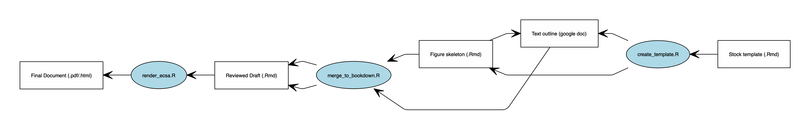

<!-- README.md is generated from README.Rmd. Please edit that file -->
Ecosystem Context for Stock Advice (ECSA)
=========================================

The goal of the ECSA project is to create bespoke documents containing contextual ecosystem information for managed stocks on the Northeast Continental Shelf. The document creation process relies on the use of survey strata (as defined by the NEFSC [Bottom Trawl Survey](https://www.nefsc.noaa.gov/femad/ecosurvey/mainpage/)) to identify stock areas from which time series of area-averaged ecosystem information can be drawn. For each area of interest, we have automated the aggregation of season-specific time series of ocean temperature and salinity (surface and bottom), zooplankton composition and abundance, and chlorophyll concentration. Each document contains time series of estimated area occupied by a given stock within the specified strata and within the ecosystem as a whole. We also provide estimates for minimum population size (abundance and biomass) based on yearly restratification of habitat given estimates of habitat occupancy.

Developing an ECSA project
--------------------------

The document creation process involves three R functions: `create_template.R`, `merge_to_bookdown.R`, and `render_ecsa.R`. The general workflow is as follows:

### 1. Draft document creation, editing text, and peer-review

Each time the function `create_template()` is called, a new draft document is created within the `/docs` folder (under the name `[stock_name]_draft.Rmd`). Passed to this function is the logical argument `send_to_google_doc` and the character string `stock_name`. Given a `stock_name`, `create_template()` populates the `generic_template.Rmd` document with relevant information for the chosen stock. The generic template is available in the `templates/` folder.

A list of passing stock names is available in the look-up table in `data/stock_data/stock_list.csv`. If `send_to_google_doc` is `TRUE`, the populated template is rendered and pushed to the google drive directory `EDABranch_Drive/Products/ECSA`. In this case, all figures within the template Rmarkdown document are rendered as static images.

At this point, text and comments can be added to the google doc for incorporation into the final bookdown document. A `README` section is included in the google doc with specific instructions for editing the document. When the editing and review process is finished, be sure to accept all comments and suggestions or they will not be pulled into the final report. All in-text citations within the google doc should be formatted in `.bib` format with full citations appended to the `/docs/ECSA_bibliography.bib` file.

### 2. Merging reviewed google doc text with Rmarkdown template

Once the review process has been completed, the finalized text may be reincorporated into the Rmarkdown template file using the function `merge_to_bookdown()`. This function merges the reviewed text with the original template file and general methods section. Any left-over curly-braces (e.g. "{{EcosystemAreaStart}}") will be removed and some simple cleaning steps are applied. You will still need to read through this document to ensure that it rendered as expected.

### 3. Building the book

The output of `merge_to_bookdown()` is an Rmarkdown document saved to the `/docs` directory. The filename will simply be `[stock_name.Rmd]` (i.e. without the "\_draft.Rmd") suffix. When you're ready to generate the final products from the reviewed text, the filename of the Rmarkdown document should be passed to the `render_ecsa()` function. This function will generate html **and** pdf versions of the report and save them to the `/docs` folder.

### 4. Making the reports accessible

To make the documents available via Github pages, the final reports (i.e. the html and pdf files), along with the directory titled `[stock_name]__files/`, should be pushed up to the ECSA repository. Once the the report files are available, you will need to knit the file `index.rmd`, which is written to detect new `.html` files in the `/docs` folder. Running `index.rmd` and pushing the resulting `index.html` file to Github will make your new report available on the [ECSA index page](noaa-edab.github.io/ECSA).

Note: The ECSA is not yet in R package format. Hence, functions must be sourced from the `R/` directory during the document development process. Template `.Rmd` files source the functions by default.
