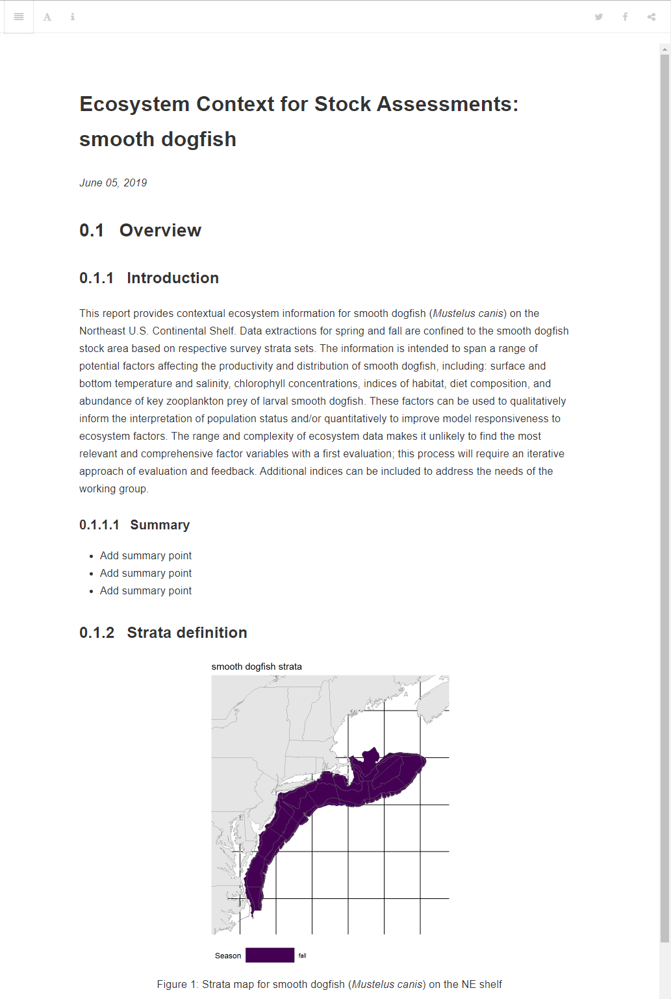

<!-- README.md is generated from README.Rmd. Please edit that file -->
ECSA
====

Ecosystem Context for Stock Advice (ECSA) reports are intended to span a range of potential factors affecting the productivity and distribution of a specific fish stock, including: surface and bottom temperature and salinity, chlorophyll concentrations, indices of habitat, diet composition, and abundance of key zooplankton prey of larval and adult fish. These factors can be used to qualitatively inform the interpretation of population status and/or quantitatively to improve model responsiveness to ecosystem factors. The range and complexity of ecosystem data makes it unlikely to find the most relevant and comprehensive factor variables with a first evaluation; this process will require an iterative approach of evaluation and feedback. Additional indices can be included to address the needs of the working group.

ECSA reports have been generated for the following stocks:

| Report                                                                                                   |
|:---------------------------------------------------------------------------------------------------------|
| <a href="https://noaa-edab.github.io/ECSA/ECSA_summer-flounder.html" target="_blank">summer flounder</a> |

Installation
------------

``` r
install.packages("remotes")
remotes::install_github("noaa-edab/ecsa")
```

Example
-------

Code used in ECSA and template to produce contextual ecosystem reports for stock assessment.

``` r
create_template(survdat_name = "SMOOTH DOGFISH", overwrite = F, output_dir = getwd())
```



*This repository is a scientific product and is not official communication of the National Oceanic and Atmospheric Administration, or the United States Department of Commerce. All NOAA GitHub project code is provided on an ‘as is’ basis and the user assumes responsibility for its use. Any claims against the Department of Commerce or Department of Commerce bureaus stemming from the use of this GitHub project will be governed by all applicable Federal law. Any reference to specific commercial products, processes, or services by service mark, trademark, manufacturer, or otherwise, does not constitute or imply their endorsement, recommendation or favoring by the Department of Commerce. The Department of Commerce seal and logo, or the seal and logo of a DOC bureau, shall not be used in any manner to imply endorsement of any commercial product or activity by DOC or the United States Government.*
