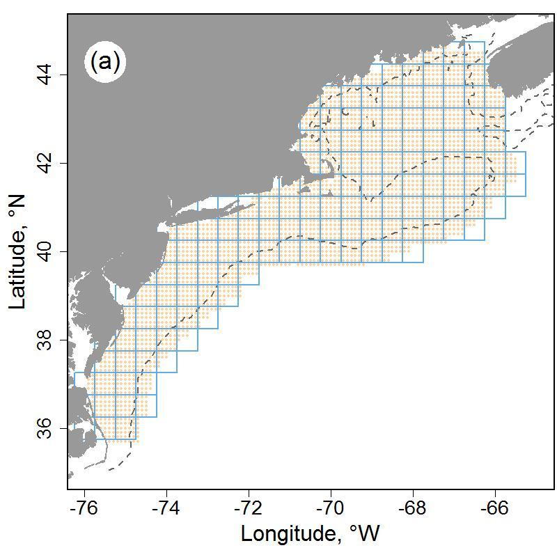
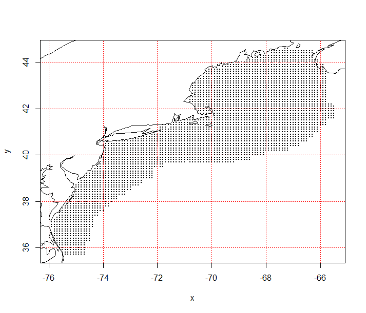

---
title:
    | 
    | Ecosystem Context for Stock Advice:
    | offshore hake and silver hake - southern Georges Bank / Mid-Atlantic
#date: "`r format(Sys.time(), '%B %d, %Y')`"
author: ""
always_allow_html: yes
bibliography: ECSA_bibliography.bib
nocite: |
  @Riley1999, @Lundblad2006, @Hobson197, @Sappington2007, @Winship2018, @Friedman2012, @Kinlan2016
link-citations: true
site: bookdown::bookdown_site
biblio-style: apalike
github-repo: NOAA-EDAB/ECSA
header-includes:
  \\usepackage{array}
favicon: favicon.ico
---

```{r, include = FALSE}
## Load packages
# library(tidyverse)
library(ggplot2)
library(tidyr)
library(dplyr)
library(plotly)
library(DT)
library(jpeg)
library(patchwork)
library(ggthemes)
library(AICcmodavg)
library(ecotrend)
library(magrittr)
library(raster)
library(stars)
library(here)
library(zoo)
library(gt)
library(kableExtra)
library(ggiraph)

knitr::opts_chunk$set(echo = F, message = F, warning = F, fig.align = 'center', eval.after = 'fig.cap')

## Read in stock area vectors

all_stock_season <- readr::read_csv(here::here("data/stock_data/stock_list.csv"),
                                 col_types = readr::cols(
                                   common_name = readr::col_character(),
                                   sci_name = readr::col_character(),
                                   cc_name = readr::col_character(),
                                   stock_name = readr::col_character(),
                                   species_code = readr::col_character(),
                                   svspp = readr::col_double(),
                                   stock_season = readr::col_character(),
                                   strata = readr::col_double()))


#zooplankton lookup table
zoo_lookup <- read.csv(here::here("data-raw/zooplankton_lookup.csv"), stringsAsFactors = F)

## Put all mustaches here
stock_code <- "69"
stock_name <- "offshore-hake-and-silver-hake_sgb-ma"
cc_name <- "offshore-hake-and-silver-hake"
common_name <- "offshore hake and silver hake"
interactive <-  ifelse(knitr::is_latex_output(), F,T)


#Special case for when north/south is included in the stock name

if (grepl("north", stock_name)){
  map_lab <- paste0('Strata map for the northern component of the offshore hake and silver hake (', ifelse(knitr::is_latex_output(), '\\textit{Merluccius albidus/Merluccius bilinearis}','*Merluccius albidus/Merluccius bilinearis*'),') stock on the NE shelf.')
} else if (grepl("south", stock_name)){
  map_lab <- paste0('Strata map for the southern component of the offshore hake and silver hake (', ifelse(knitr::is_latex_output(), '\\textit{Merluccius albidus/Merluccius bilinearis}','*Merluccius albidus/Merluccius bilinearis*'),') stock on the NE shelf.')
} else {
  map_lab <- "Strata map for the offshore hake and silver hake (Merluccius albidus/Merluccius bilinearis) stock on the NE shelf."
}

#Get stock strata and unique identifiers
strata <- all_stock_season %>%   
  dplyr::filter(stock_name == !!stock_name)

source(here::here("R/map_strata.R"))
source(here::here("R/get_strata.R"))
source(here::here("R/crop_to_strata.R"))
source(here::here("R/stars_to_series.R"))
source(here::here("R/tab_plotly.R"))
source(here::here("R/create_buttons.R"))
source(here::here("R/STARS_v18.R"))
source(here::here("R/gls_summary.R"))
source(here::here("R/plot_sae.R"))
source(here::here("R/fit_regime_and_trend.R"))


svspp <- strata %>% pull(svspp) %>% unique()
sixcode <- strata %>% pull(species_code) %>% unique()
subarea <- strata %>% pull(stock_subarea) %>% unique()

if (is.na(subarea)){
  subarea <- "unit"
}

#Specific analytical treatments were selected beforehand for each stock. These data are in data-raw/treatment_selection.csv. We import here and filter the below SAE data by treatment selection. 
treatment_selection <- 
  read.csv(here::here("data-raw/treatment-selection.csv"),
                       stringsAsFactors = F) %>% 
  filter(svspp == !!svspp, stock == subarea) 

#Load swept area estimate data. Filter by svspp code and treatment selection
spring_sae <- read.csv(here::here("data-raw/spring_sae_tb_sum.csv"),
                       stringsAsFactors = F) %>% 
  filter(svspp == !!svspp,
         stocks == subarea)

fall_sae <- read.csv(here::here("data-raw/fall_sae_tb_sum.csv"),
                     stringsAsFactors = F) %>% 
  filter(svspp == !!svspp,
         stocks == subarea)

#Adjust knitr fig height if a facet plot is needed
if (nrow(spring_sae) > 0 & length(unique(spring_sae$stocks)) > 1){
 adjust_for_facet  <- 9
} else if (nrow(spring_sae) > 0 & length(unique(spring_sae$stocks)) > 1){
  adjust_for_facet  <- 9
} else {
  adjust_for_facet  <- 6
}

#Get available seasons for stocks
stock_season <- strata %>% pull(stock_season) %>% unique()

#Get estimates for ecosystem and stock habitat area
stock_habitat_area <- read.csv(here::here("data-raw/sum_ocl_byunit_sprfall.csv"),
                                   stringsAsFactors = F) %>% 
  filter(species.code == sixcode)

ecosystem_habitat_area <- read.csv(here::here("data-raw/sum_ocl_spr and fall.csv"),
                               stringsAsFactors = F)  %>% 
  filter(species.code == sixcode)

#Set interactive to F when pushing a draft document to google drive. Otherwise, the ggiraph figures will render as interactive. Interactive figures should only be used during the creation of the final bookdown document. 

#Switches the encoding for the degree symbol (i.e. LaTeX or HTML)
degree <- ifelse(knitr::is_latex_output(),"\\textdegree " ,'&deg;')
kable_format <- ifelse(knitr::is_latex_output(), "latex", "html")

# add link to stock name files folder for storing time series data
url1 <- "https://github.com/NOAA-EDAB/ECSA/tree/master/docs/"
url2 <- "_files"
url<-noquote(sprintf("%s%s%s",url1, stock_name, url2))

```


# Introduction


This report provides contextual ecosystem information for southern Georges Bank/mid-Atlantic offshore hake and silver hake (*Merluccius albidus/Merluccius bilinearis*) on the Northeast U.S. Continental Shelf. Data extractions for spring and fall are confined to the offshore hake and silver hake stock area based on respective survey strata sets. The information is intended to span a range of potential factors affecting the productivity and distribution of offshore hake and silver hake, including: surface and bottom temperature and salinity, chlorophyll concentrations, indices of habitat, diet composition, and abundance of key zooplankton prey of larval offshore hake and silver hake. These factors can be used to qualitatively inform the interpretation of population status and/or quantitatively to improve model responsiveness to ecosystem factors. The range and complexity of ecosystem data makes it unlikely to find the most relevant and comprehensive factor variables with a first evaluation; this process will require an iterative approach of evaluation and feedback. Additional indices can be included to address the needs of the working group.

Link to available [time series data](`r url`) used below.


### Stock area {-#stock-area}

```{r strata-map, eval = T, echo = FALSE, fig.cap = map_lab, message = FALSE, warning = FALSE, fig.align='center'}
map_strata(stock_name = stock_name,
           common_name = common_name,
           stock_season = stock_season,
           strata = strata,
           overwrite = FALSE,
           save_plot = FALSE)


```

**A note on figures**

Unless otherwise noted, time series in this document are represented by dark blue lines. Estimates of linear trends and regime shifts are included on plots when found to be significant (p < 0.05), and are shown by light blue and green lines respectively. Trend strengths and confidence intervals are also included in plot titles when trends are present. Trends were modeled using a GLS model selection approach [see @hardison2019 for details].

_Last updated on `r format(Sys.Date(), format = "%B %e %Y")`._

# Temperature


An optimal interpolation procedure was used to estimate NE Shelf surface and bottom temperatures for two seasonal time frames ([see methods](#methodstempsalin)). The temperature estimates were standardized to April 3 and October 11 for spring and fall over the period 1968-2018. Surface and bottom temperature within the `r common_name` stock areas are shown below.


## Bottom Temperature {-#bottom-temperature}


```{r bot_temp_process}

spring_bottom_temp <- 
  fit_regime_and_trend(r = "temperature_spring_bottom.rdata",
                stock_name = stock_name,
                common_name = common_name,
                stock_season = stock_season,
                data_season = "spring",
                measure_name = "bottom_temp")
spring_title <- spring_bottom_temp$plot_title

fall_bottom_temp <- 
  fit_regime_and_trend(r = "temperature_fall_bottom.rdata",
                stock_name = stock_name,
                common_name = common_name,
                stock_season = stock_season,
                data_season = "fall",
                measure_name = "bottom_temp")
fall_title <- fall_bottom_temp$plot_title

#Only show plots based on what seasons are available. If strata are available for spring and fall, show both plots. Otherwise just one.

# Spring is print_plot[1] and fall is print_plot[2]

if (any(stock_season == "both") | all(stock_season == c('spring','fall'))){
  print_plot <- c(T,T)
} else if (stock_season == "spring") {
  print_plot <- c(T,F)
} else if (stock_season == "fall"){
  print_plot <- c(F,T)
}
```


```{r bot_temp_spring_plt, fig.height=3, eval = print_plot[1]}

spring_bottom_temp_plt <- 
  spring_bottom_temp$df %>% 
    tidyr::gather(Var, Value, -Time) %>% 
  mutate(tooltip = paste0("<table><tr><td>Year:</td><td>",Time,"</td></tr><tr><td>Value:  </td><td>",round(Value,3),"</td></tr></table>")) %>% 
  ggplot(aes(x = Time, 
            y = Value, color = Var, group = Var,
                 tooltip = tooltip,
                 data_id = Time)) +
  geom_line(size = 1)+
  {if(interactive) geom_point_interactive(size = 0)
    else geom_line(size = 1)} +
    scale_color_manual(values = 
                         c("Regime mean" = "#b2df8a",
                         "Trend" = "#a6cee3",
                         "Series" = "#1f78b4"))+
    theme_bw() +
    theme(legend.title = element_blank(),
          legend.position = "bottom") +
    ylab("Temperature (°C)") +
    ggtitle(spring_title)

if (interactive){
  girafe_options(girafe(code = print(spring_bottom_temp_plt), width_svg = 8.5),opts_hover(css = "r:2pt;") )
} else {
  spring_bottom_temp_plt
}

```


```{r bot-temp-fall-plt, fig.height=3, eval = print_plot[2]}
fall_bottom_temp_plt <- 
  fall_bottom_temp$df %>% 
    tidyr::gather(Var, Value, -Time) %>% 
  mutate(tooltip = paste0("<table><tr><td>Year:</td><td>",Time,"</td></tr><tr><td>Value:  </td><td>",round(Value,3),"</td></tr></table>")) %>% 
  ggplot(aes(x = Time, 
            y = Value, color = Var, group = Var,
                 tooltip = tooltip,
                 data_id = Time)) +
  geom_line(size = 1)+
  {if(interactive) geom_point_interactive(size = 0)
    else geom_line(size = 1)} +
    scale_color_manual(values = 
                         c("Regime mean" = "#b2df8a",
                         "Trend" = "#a6cee3",
                         "Series" = "#1f78b4"))+
    theme_bw() +
    theme(legend.title = element_blank(),
          legend.position = "bottom") +
    ylab("Temperature (°C)") +
    ggtitle(fall_title)

if (interactive){
  girafe_options(girafe(code = print(fall_bottom_temp_plt), width_svg = 8.5),opts_hover(css = "r:2pt;") )
} else {
  fall_bottom_temp_plt
}

```


## Surface Temperature {-#surface-temperature}


```{r surf-temp-process}

spring_surface_temp <- 
  fit_regime_and_trend(r = "temperature_spring_surface.rdata",
                stock_name = stock_name,
                common_name = common_name,
                stock_season = stock_season,
                data_season = "spring",
                measure_name = "surface_temp")
spring_title <- spring_surface_temp$plot_title

fall_surface_temp <- 
  fit_regime_and_trend(r = "temperature_fall_surface.rdata",
                stock_name = stock_name,
                common_name = common_name,
                stock_season = stock_season,
                data_season = "fall",
                measure_name = "surface_temp")
fall_title <- fall_surface_temp$plot_title
```


```{r surf-temp-spring-plt, fig.height=3, eval = print_plot[1]}

spring_surface_temp_plt <- 
  spring_surface_temp$df %>% 
    tidyr::gather(Var, Value, -Time) %>% 
  mutate(tooltip = paste0("<table><tr><td>Year:</td><td>",Time,"</td></tr><tr><td>Value:  </td><td>",round(Value,3),"</td></tr></table>")) %>% 
  ggplot(aes(x = Time, 
            y = Value, color = Var, group = Var,
                 tooltip = tooltip,
                 data_id = Time)) +
  geom_line(size = 1)+
  {if(interactive) geom_point_interactive(size = 0)
    else geom_line(size = 1)} +
    scale_color_manual(values = 
                         c("Regime mean" = "#b2df8a",
                         "Trend" = "#a6cee3",
                         "Series" = "#1f78b4"))+
    theme_bw() +
    theme(legend.title = element_blank(),
          legend.position = "bottom") +
    ylab("Temperature (°C)") +
    ggtitle(spring_title)

if (interactive){
  girafe_options(girafe(code = print(spring_surface_temp_plt), width_svg = 8.5),opts_hover(css = "r:2pt;") )
} else {
  spring_surface_temp_plt
}

```

```{r surf-temp-fall-plt, fig.height=3, eval = print_plot[2]}

fall_surface_temp_plt <- 
  fall_surface_temp$df %>% 
    tidyr::gather(Var, Value, -Time) %>% 
  mutate(tooltip = paste0("<table><tr><td>Year:</td><td>",Time,"</td></tr><tr><td>Value:  </td><td>",round(Value,3),"</td></tr></table>")) %>% 
  ggplot(aes(x = Time, 
            y = Value, color = Var, group = Var,
                 tooltip = tooltip,
                 data_id = Time)) +
  geom_line(size = 1)+
  {if(interactive) geom_point_interactive(size = 0)
    else geom_line(size = 1)} +
    scale_color_manual(values = 
                         c("Regime mean" = "#b2df8a",
                         "Trend" = "#a6cee3",
                         "Series" = "#1f78b4"))+
    theme_bw() +
    theme(legend.title = element_blank(),
          legend.position = "bottom") +
    ylab("Temperature (°C)") +
    ggtitle(fall_title)

if (interactive){
  girafe_options(girafe(code = print(fall_surface_temp_plt), width_svg = 8.5),opts_hover(css = "r:2pt;") )
} else {
  fall_surface_temp_plt
}
```


# Salinity


An optimal interpolation procedure was used to estimate NE Shelf surface and bottom salinity for two seasonal time frames ([see methods](#methodstempsalin)). Though collected with temperature data, reliable instrumentation limits this time series to 1992-2018. The salinity estimates were standardized to April 3 and October 11 for spring and fall. Surface and bottom salinities within the `r common_name` stock areas are shown below.


## Bottom Salinity {-#bottom-salinity}


```{r bot-sal-process}

spring_bottom_sal <- 
  fit_regime_and_trend(r = "salinity_spring_bottom.rdata",
                stock_name = stock_name,
                common_name = common_name,
                stock_season = stock_season,
                data_season = "spring",
                measure_name = "bottom_sal")
spring_title <- spring_bottom_sal$plot_title

fall_bottom_sal <- 
  fit_regime_and_trend(r = "salinity_fall_bottom.rdata",
                stock_name = stock_name,
                common_name = common_name,
                stock_season = stock_season,
                data_season = "fall",
                measure_name = "bottom_sal")
fall_title <- fall_bottom_sal$plot_title

```


```{r bot-sal-spring-plt, fig.height=3, eval = print_plot[1]}

spring_bottom_sal_plt <- 
  spring_bottom_sal$df %>% 
    tidyr::gather(Var, Value, -Time) %>% 
  mutate(tooltip = paste0("<table><tr><td>Year:</td><td>",Time,"</td></tr><tr><td>Value:  </td><td>",round(Value,3),"</td></tr></table>")) %>% 
  ggplot(aes(x = Time, 
            y = Value, color = Var, group = Var,
                 tooltip = tooltip,
                 data_id = Time)) +
  geom_line(size = 1)+
  {if(interactive) geom_point_interactive(size = 0)
    else geom_line(size = 1)} +
    scale_color_manual(values = 
                         c("Regime mean" = "#b2df8a",
                         "Trend" = "#a6cee3",
                         "Series" = "#1f78b4"))+
    theme_bw() +
    theme(legend.title = element_blank(),
          legend.position = "bottom") +
    ylab("Salinity (PSU)") +
    ggtitle(spring_title)

if (interactive){
  girafe_options(girafe(code = print(spring_bottom_sal_plt), width_svg = 8.5),opts_hover(css = "r:2pt;") )
} else {
  spring_bottom_sal_plt
}
```


```{r bot-sal-fall-plt, fig.height=3, eval = print_plot[2]}

fall_bottom_sal_plt <- 
  fall_bottom_sal$df %>% 
    tidyr::gather(Var, Value, -Time) %>% 
  mutate(tooltip = paste0("<table><tr><td>Year:</td><td>",Time,"</td></tr><tr><td>Value:  </td><td>",round(Value,3),"</td></tr></table>")) %>% 
  ggplot(aes(x = Time, 
            y = Value, color = Var, group = Var,
                 tooltip = tooltip,
                 data_id = Time)) +
  geom_line(size = 1)+
  {if(interactive) geom_point_interactive(size = 0)
    else geom_line(size = 1)} +
    scale_color_manual(values = 
                         c("Regime mean" = "#b2df8a",
                         "Trend" = "#a6cee3",
                         "Series" = "#1f78b4"))+
    theme_bw() +
    theme(legend.title = element_blank(),
          legend.position = "bottom") +
    ylab("Salinity (PSU)") +
    ggtitle(fall_title)

if (interactive){
  girafe_options(girafe(code = print(fall_bottom_sal_plt), width_svg = 8.5),opts_hover(css = "r:2pt;") )
} else {
  fall_bottom_sal_plt
}
```


## Surface Salinity {-#surface-salinity}


```{r surf-sal-process}
spring_surface_sal <- 
  fit_regime_and_trend(r = "salinity_spring_surface.rdata",
                stock_name = stock_name,
                common_name = common_name,
                stock_season = stock_season,
                data_season = "spring",
                measure_name = "surface_sal")
spring_title <- spring_surface_sal$plot_title

fall_surface_sal <- 
  fit_regime_and_trend(r = "salinity_fall_surface.rdata",
                stock_name = stock_name,
                common_name = common_name,
                stock_season = stock_season,
                data_season = "fall",
                measure_name = "surface_sal")
fall_title <- fall_surface_sal$plot_title

```


```{r surf-sal-spring-plt, fig.height=3, eval = print_plot[1]}
spring_surface_sal_plt <- 
  spring_surface_sal$df %>% 
    tidyr::gather(Var, Value, -Time) %>% 
  mutate(tooltip = paste0("<table><tr><td>Year:</td><td>",Time,"</td></tr><tr><td>Value:  </td><td>",round(Value,3),"</td></tr></table>")) %>% 
  ggplot(aes(x = Time, 
            y = Value, color = Var, group = Var,
                 tooltip = tooltip,
                 data_id = Time)) +
  geom_line(size = 1)+
  {if(interactive) geom_point_interactive(size = 0)
    else geom_line(size = 1)} +
    scale_color_manual(values = 
                         c("Regime mean" = "#b2df8a",
                         "Trend" = "#a6cee3",
                         "Series" = "#1f78b4"))+
    theme_bw() +
    theme(legend.title = element_blank(),
          legend.position = "bottom") +
    ylab("Salinity (PSU)") +
    ggtitle(spring_title)

if (interactive){
  girafe_options(girafe(code = print(spring_surface_sal_plt), width_svg = 8.5),opts_hover(css = "r:2pt;") )
} else {
  spring_surface_sal_plt
}
```


```{r surf-sal-fall-plt, fig.height=3, eval = print_plot[2]}
fall_surface_sal_plt <- 
  fall_surface_sal$df %>% 
    tidyr::gather(Var, Value, -Time) %>% 
  mutate(tooltip = paste0("<table><tr><td>Year:</td><td>",Time,"</td></tr><tr><td>Value:  </td><td>",round(Value,3),"</td></tr></table>")) %>% 
  ggplot(aes(x = Time, 
            y = Value, color = Var, group = Var,
                 tooltip = tooltip,
                 data_id = Time)) +
  geom_line(size = 1)+
  {if(interactive) geom_point_interactive(size = 0)
    else geom_line(size = 1)} +
    scale_color_manual(values = 
                         c("Regime mean" = "#b2df8a",
                         "Trend" = "#a6cee3",
                         "Series" = "#1f78b4"))+
    theme_bw() +
    theme(legend.title = element_blank(),
          legend.position = "bottom") +
    ylab("Salinity (PSU)") +
    ggtitle(fall_title)

if (interactive){
  girafe_options(girafe(code = print(fall_surface_sal_plt), width_svg = 8.5),opts_hover(css = "r:2pt;") )
} else {
  fall_surface_sal_plt
}
```

# Chlorophyll


## Chlorophyll concentration in the stock area {-#chlorophyll-concentration-in-the-stock-area}


The concentration of chlorophyll was measured with a suite of satellite sensors and merged into a single dataset ([see methods](#methodschl)). Chlorophyll concentrations in the spring and fall `r common_name` stock areas are shown below.


```{r chl-processing}
spring_chl <- 
  fit_regime_and_trend(r = "chlorophyll_conc_spring.rdata",
              stock_name = stock_name, 
              common_name = common_name, 
              stock_season = stock_season,
              data_season = "spring",
                measure_name = "biomass",
                process_to_season = "spring")
spring_title <- spring_chl$plot_title


fall_chl <- 
  fit_regime_and_trend(r = "chlorophyll_conc_fall.rdata",
              stock_name = stock_name, 
              common_name = common_name, 
              stock_season = stock_season,
              data_season = "fall",
                measure_name = "biomass",
                process_to_season = "fall")
fall_title <- fall_chl$plot_title
```


```{r chl-spring-plt, fig.height=3, eval = print_plot[1]}
spring_chl_plt <- 
  spring_chl$df %>% 
    tidyr::gather(Var, Value, -Time) %>% 
  mutate(tooltip = paste0("<table><tr><td>Year:</td><td>",Time,"</td></tr><tr><td>Value:  </td><td>",round(Value,3),"</td></tr></table>")) %>% 
  ggplot(aes(x = Time, 
            y = Value, color = Var, group = Var,
                 tooltip = tooltip,
                 data_id = Time)) +
  geom_line(size = 1)+
  {if(interactive) geom_point_interactive(size = 0)
    else geom_line(size = 1)} +
    scale_color_manual(values = 
                         c("Regime mean" = "#b2df8a",
                         "Trend" = "#a6cee3",
                         "Series" = "#1f78b4"))+
    theme_bw() +
    theme(legend.title = element_blank(),
          legend.position = "bottom") +
    ylab(expression(paste("Chlorophyll (mg ", m^{-3}, ")")))+
    ggtitle(spring_title)

if (interactive){
  girafe_options(girafe(code = print(spring_chl_plt), width_svg = 8.5),opts_hover(css = "r:2pt;") )
} else {
  spring_chl_plt
}
```


```{r chl-fal-plt, fig.height=3, eval = print_plot[2]}
fall_chl_plt <- 
  fall_chl$df %>% 
    tidyr::gather(Var, Value, -Time) %>% 
  mutate(tooltip = paste0("<table><tr><td>Year:</td><td>",Time,"</td></tr><tr><td>Value:  </td><td>",round(Value,3),"</td></tr></table>")) %>% 
  ggplot(aes(x = Time, 
            y = Value, color = Var, group = Var,
                 tooltip = tooltip,
                 data_id = Time)) +
  geom_line(size = 1)+
  {if(interactive) geom_point_interactive(size = 0)
    else geom_line(size = 1)} +
    scale_color_manual(values = 
                         c("Regime mean" = "#b2df8a",
                         "Trend" = "#a6cee3",
                         "Series" = "#1f78b4"))+
    theme_bw() +
    theme(legend.title = element_blank(),
          legend.position = "bottom") +
    ylab(expression(paste("Chlorophyll (mg ", m^{-3}, ")")))+
    ggtitle(fall_title)

if (interactive){
  girafe_options(girafe(code = print(fall_chl_plt), width_svg = 8.5),opts_hover(css = "r:2pt;") )
} else {
  fall_chl_plt
}
```


# Zooplankton


## Copepod abundance {-#copepod-abundance}


```{r zoo-cope-processing}
spring_cope <- 
  fit_regime_and_trend(r = "zoo_spring_rasters_1yr.rdata",
                        stock_name = stock_name, 
                        common_name = common_name, 
                        stock_season = stock_season,
                        data_season = "spring",
                        measure_name = "zoo",
                        group_regex = "[^A-Z_](.*)(?=_)") %>% 
  mutate(season = "spring") %>% 
  left_join(.,zoo_lookup, by = "Grouping") %>% 
  dplyr::filter(copepod == "y") %>% 
  dplyr::select(-Grouping, -season, -copepod) %>%
  tidyr::spread(full_name, Mean)

spring_min <- min(spring_cope$Time)

fall_cope <- 
  fit_regime_and_trend(r = "zoo_fall_rasters_1yr.rdata",
                        stock_name = stock_name, 
                        common_name = common_name, 
                        stock_season = stock_season,
                        data_season = "fall",
                        measure_name = "zoo",
                        group_regex = "[^A-Z_](.*)(?=_)") %>% 
  mutate(season = "fall") %>% 
  left_join(.,zoo_lookup, by = "Grouping") %>% 
  dplyr::filter(copepod == "y") %>% 
  dplyr::select(-Grouping, -season, -copepod) %>%
  tidyr::spread(full_name, Mean)

fall_min <- min(fall_cope$Time)

write.csv(spring_cope, file=here::here("docs", paste0(stock_name,"_files/spring_cope.csv")))
write.csv(fall_cope, file=here::here("docs", paste0(stock_name,"_files/fall_cope.csv")))
```

```{r, zoo-cope-spring, fig.height=5, eval = print_plot[1]}
if (interactive){
  buttons <- create_buttons(spring_cope)

spring_cope_plt <-
  tab_plotly(spring_cope, add_smoother = F, showlegend = F) %>% 
  layout(title = "Spring copepod abundance",
         yaxis = list(title = "Abundance (log num m<sup>-3</sup>)",
                      hoverformat = '.3f', mirror = TRUE, showline = TRUE),
         xaxis = list(title = "", mirror = TRUE, showline = TRUE),
         updatemenus = 
        
        list(
           list(
            buttons = list(buttons[[1]],buttons[[2]],buttons[[3]]),
                      type = "buttons",
                      direction = "right",
                      xanchor = "center",
                      yanchor = "top",
                      pad = list("r"= 0, "t"= 10, "b" = 10),
                      x = 0.5,
                      y = -0.2
                      ),
          list(
           buttons = list(buttons[[4]],buttons[[5]],buttons[[6]]),
                      type = "buttons",
                      direction = "right",
                      xanchor = "center",
                      yanchor = "top",
                      pad = list("r"= 0, "t"= 10, "b" = 10),
                      x = 0.5,
                      y = -0.3
                      ),
          list(
           buttons = list(buttons[[7]],buttons[[8]]),
                      type = "buttons",
                      direction = "right",
                      xanchor = "center",
                      yanchor = "top",
                      pad = list("r"= 0, "t"= 10, "b" = 10),
                      x = 0.5,
                      y = -0.4
                      )
                     )
                    )

spring_cope_plt
  
} else {
  spring_cope %>% 
    tidyr::gather(Var, Value, -Time) %>% 
    ggplot() +
    geom_line(aes(x = Time, y = Value, group = Var)) +
    facet_wrap(Var~., scales = "free_y") +
    theme_bw() +
    ylab(expression(paste("Abundance (log num ", m^{-3}, ")"))) +
    theme(strip.text = element_text(face = "italic"),
          strip.background = element_blank(),
          axis.text.x = element_text(angle = 45, hjust = 1)) +
    ggtitle("Spring copepod abundance")
}


```


```{r zoo-cope-fall, fig.height=5, fig.height=5, eval = print_plot[2]}

if (interactive){
  buttons <- create_buttons(fall_cope)

fall_cope_plt <-
  tab_plotly(fall_cope, add_smoother = F, showlegend = F) %>% 
  layout(title = "Fall copepod abundance",
         yaxis = list(title = "Abundance (log num m<sup>-3</sup>)",
                      hoverformat = '.3f', mirror = TRUE, showline = TRUE),
         xaxis = list(title = "", mirror = TRUE, showline = TRUE),
         updatemenus = 
        
        list(
           list(
            buttons = list(buttons[[1]],buttons[[2]],buttons[[3]]),
                      type = "buttons",
                      direction = "right",
                      xanchor = "center",
                      yanchor = "top",
                      pad = list("r"= 0, "t"= 10, "b" = 10),
                      x = 0.5,
                      y = -0.2
                      ),
          list(
           buttons = list(buttons[[4]],buttons[[5]],buttons[[6]]),
                      type = "buttons",
                      direction = "right",
                      xanchor = "center",
                      yanchor = "top",
                      pad = list("r"= 0, "t"= 10, "b" = 10),
                      x = 0.5,
                      y = -0.3
                      ),
          list(
           buttons = list(buttons[[7]],buttons[[8]]),
                      type = "buttons",
                      direction = "right",
                      xanchor = "center",
                      yanchor = "top",
                      pad = list("r"= 0, "t"= 10, "b" = 10),
                      x = 0.5,
                      y = -0.4
                      )
                     )
                    )

fall_cope_plt
  
} else {
  fall_cope %>% 
    tidyr::gather(Var, Value, -Time) %>% 
    ggplot() +
    geom_line(aes(x = Time, y = Value, group = Var)) +
    facet_wrap(Var~., scales = "free_y") +
    theme_bw() +
    ylab(expression(paste("Abundance (log num ", m^{-3}, ")"))) +
        theme(strip.text = element_text(face = "italic"),
          strip.background = element_blank(),
          axis.text.x = element_text(angle = 45, hjust = 1)) +
    ggtitle("Fall copepod abundance")
}

```

## Non-copepod zooplankton abundance {-#non-copepod-zooplankton-abundance}


```{r zoo-noncope-processing}
spring_noncope <- 
  fit_regime_and_trend(r = "zoo_spring_rasters_1yr.rdata",
                        stock_name = stock_name, 
                        common_name = common_name, 
                        stock_season = stock_season,
                        data_season = "spring",
                        measure_name = "zoo",
                        group_regex = "[^A-Z_](.*)(?=_)") %>% 
  mutate(season = "spring") %>% 
  left_join(.,zoo_lookup, by = "Grouping") %>% 
  dplyr::filter(copepod == "n") %>% 
  dplyr::select(-Grouping, -season, -copepod) %>%
  tidyr::spread(full_name, Mean)

spring_min <- min(spring_noncope$Time)

fall_noncope <- 
  fit_regime_and_trend(r = "zoo_fall_rasters_1yr.rdata",
                        stock_name = stock_name, 
                        common_name = common_name, 
                        stock_season = stock_season,
                        data_season = "fall",
                        measure_name = "zoo",
                        group_regex = "[^A-Z_](.*)(?=_)") %>% 
  mutate(season = "fall") %>% 
  left_join(.,zoo_lookup, by = "Grouping") %>% 
  dplyr::filter(copepod == "n") %>% 
  dplyr::select(-Grouping, -season, -copepod) %>%
  tidyr::spread(full_name, Mean)

fall_min <- min(fall_noncope$Time)

write.csv(spring_noncope, file=here::here("docs", paste0(stock_name,"_files/spring_noncope.csv")))
write.csv(fall_noncope, file=here::here("docs", paste0(stock_name,"_files/fall_noncope.csv")))
```

```{r zoo-spring-noncope, fig.height=5, eval = print_plot[1]}
if (interactive){

buttons <- create_buttons(spring_noncope)

spring_noncope_plt <-
  tab_plotly(spring_noncope, add_smoother = F, showlegend = F) %>% 
  layout(title = "Spring non-copepod zoo. abundance",
         yaxis = list(title = "Abundance (log num m<sup>-3</sup>)",
                      hoverformat = '.3f', mirror = TRUE, showline = TRUE),
         showlegend = F,
         updatemenus = 
        
        list(
           list(
            buttons = list(buttons[[1]],buttons[[2]],buttons[[3]],buttons[[4]]),
                      type = "buttons",
                      direction = "right",
                      xanchor = "center",
                      yanchor = "top",
                      pad = list("r"= 0, "t"= 10, "b" = 10),
                      x = 0.5,
                      y = -0.2
                      ),
          list(
           buttons = list(buttons[[5]],buttons[[6]],buttons[[7]]),
                      type = "buttons",
                      direction = "right",
                      xanchor = "center",
                      yanchor = "top",
                      pad = list("r"= 0, "t"= 10, "b" = 10),
                      x = 0.5,
                      y = -0.3
                      ),
          list(
           buttons = list(buttons[[8]],buttons[[9]],buttons[[10]]),
                      type = "buttons",
                      direction = "right",
                      xanchor = "center",
                      yanchor = "top",
                      pad = list("r"= 0, "t"= 10, "b" = 10),
                      x = 0.5,
                      y = -0.4
                      )
                     )
                    )

spring_noncope_plt

} else {
  
  spring_noncope %>% 
    tidyr::gather(Var, Value, -Time) %>% 
    ggplot() +
    geom_line(aes(x = Time, y = Value, group = Var)) +
    facet_wrap(Var~., scales = "free_y") +
    theme_bw() +
    ylab(expression(paste("Abundance (log num ", m^{-3}, ")"))) +
        theme(strip.text = element_text(face = "italic"),
          strip.background = element_blank(),
          axis.text.x = element_text(angle = 45, hjust = 1)) +
    ggtitle("Spring non-copepod zoo. abundance")
}
```

```{r zoo-fall-noncope, fig.height=5, eval = print_plot[2]}
if (interactive){

buttons <- create_buttons(fall_noncope)

fall_noncope_plt <-
  tab_plotly(fall_noncope, add_smoother = F, showlegend = F) %>% 
  layout(title = "Fall non-copepod zoo. abundance",
         yaxis = list(title = "Abundance (log num m<sup>-3</sup>)",
                      hoverformat = '.3f', mirror = TRUE, showline = TRUE),
         showlegend = F,
         updatemenus = 
        
        list(
           list(
            buttons = list(buttons[[1]],buttons[[2]],buttons[[3]],buttons[[4]]),
                      type = "buttons",
                      direction = "right",
                      xanchor = "center",
                      yanchor = "top",
                      pad = list("r"= 0, "t"= 10, "b" = 10),
                      x = 0.5,
                      y = -0.2
                      ),
          list(
           buttons = list(buttons[[5]],buttons[[6]],buttons[[7]]),
                      type = "buttons",
                      direction = "right",
                      xanchor = "center",
                      yanchor = "top",
                      pad = list("r"= 0, "t"= 10, "b" = 10),
                      x = 0.5,
                      y = -0.3
                      ),
          list(
           buttons = list(buttons[[8]],buttons[[9]],buttons[[10]]),
                      type = "buttons",
                      direction = "right",
                      xanchor = "center",
                      yanchor = "top",
                      pad = list("r"= 0, "t"= 10, "b" = 10),
                      x = 0.5,
                      y = -0.4
                      )
                     )
                    )

fall_noncope_plt

} else {
  
  fall_noncope %>% 
    tidyr::gather(Var, Value, -Time) %>% 
    ggplot() +
    geom_line(aes(x = Time, y = Value, group = Var)) +
    facet_wrap(Var~., scales = "free_y") +
    theme_bw() +
    ylab(expression(paste("Abundance (log num ", m^{-3}, ")"))) +
        theme(strip.text = element_text(face = "italic"),
          strip.background = element_blank(),
          axis.text.x = element_text(angle = 45, hjust = 1)) +
    ggtitle("Fall non-copepod zoo. abundance")
}
```


# Habitat and abundance


## Occurrence probability {-#occurrence-probability}


The probability of occurrence was estimated using random forest classification models ([see methods](#methodsocc)). The mean annual probabilities were extracted for the spring and/or fall stock definition areas. These data provide an estimate of the potential use of the habitat associated with the stock definition.


```{r occ-prob, fig.height=4}

spring_occ_prob <- 
  fit_regime_and_trend(r =  paste0("spri_",sixcode,"_occ_prob.rdata"),
                        stock_name = stock_name, 
                        common_name = common_name, 
                        stock_season = stock_season,
                data_season = "spring",
                measure_name = "occurrence")$df %>% 
  dplyr::select(Time, Spring = Series)

fall_occ_prob <- 
  fit_regime_and_trend(r =  paste0("fall_",sixcode,"_occ_prob.rdata"),
                        stock_name = stock_name, 
                        common_name = common_name, 
                        stock_season = stock_season,
                data_season = "fall",
                measure_name = "occurrence")$df %>% 
  dplyr::select(Time, Fall = Series)

write.csv(spring_occ_prob, file=here::here("docs", paste0(stock_name,"_files/spring_occ_prob.csv")))
write.csv(fall_occ_prob, file=here::here("docs", paste0(stock_name,"_files/fall_occ_prob.csv")))

if (all(print_plot)){
  occ_prob <- spring_occ_prob %>% 
    left_join(.,fall_occ_prob, by  = "Time") %>% 
    dplyr::select(Time, Spring, Fall)
} else if (print_plot[1]){
  occ_prob <- spring_occ_prob %>% 
    dplyr::select(Time, Spring)
} else if (print_plot[2]){
  occ_prob <- fall_occ_prob %>% 
    dplyr::select(Time, Fall)
}
  


occ_prob_plt <- 
  occ_prob %>% 
    tidyr::gather(Var, Value, -Time) %>% 
  mutate(tooltip = paste0("<table><tr><td>Year:</td><td>",Time,"</td></tr><tr><td>Value:  </td><td>",round(Value,3),"</td></tr></table>")) %>% 
  ggplot(aes(x = Time, 
            y = Value, color = Var, group = Var,
                 tooltip = tooltip,
                 data_id = Time)) +
  geom_line(size = 1)+
  {if(interactive) geom_point_interactive(size = 0)
    else geom_line(size = 1)} +
    scale_color_manual(values = 
                         c("Fall" = "#a6cee3",
                         "Spring" = "#1f78b4"))+
    theme_bw() +
    theme(legend.title = element_blank(),
          legend.position = "bottom") +
    ylab("Occupancy probability")+
    ggtitle("Occupancy probability")

if (interactive){
  girafe_options(girafe(code = print(occ_prob_plt), width_svg = 8.5),opts_hover(css = "r:2pt;") )
} else {
  occ_prob_plt
}
```

```{r}
myList <- list(spring_bottom_temp = spring_bottom_temp,
               fall_bottom_temp = fall_bottom_temp, 
               spring_surface_temp = spring_surface_temp,
               fall_surface_temp = fall_surface_temp,
               spring_bottom_sal = spring_bottom_sal, 
               fall_bottom_sal = fall_bottom_sal, 
               spring_surface_sal = spring_surface_sal, 
               spring_chl = spring_chl,
               fall_chl = fall_chl)

for(i in names(myList)){
  k <- myList[[i]]$df %>% tidyr::gather(Var, Value, -Time)
  #print(k)
  write.csv(k, file=here::here("docs", paste0(stock_name,"_files/"), paste0(i,".csv")))
}

```

# Methods {#methods}

## Surface and Bottom Temperature and Salinity {-#methodstempsalin}

### Study System
The U.S. Northeast Shelf ecosystem, which roughly aligns with the boundaries of the Northeast U.S. Continental Shelf Large Marine Ecosystem (LME), is the study area for the surface and bottom thermal environments. Surface and bottom temperatures were estimated over a 0.1° latitude/longitude grid, termed the estimation grid, which circumscribes the range of ecosystem assessment areas in the [region](#fig:study-area). The difference between the extents of the estimation grid from the extent of the LME relate to the resource management programs that are the sources of the data, which are focused on fishery management needs in the region. 

### Data Source
Temperature and salinity were collected on the Northeast Shelf as part of ongoing resource and ecosystem surveys conducted by the Northeast Fisheries Science Center. Water column temperatures have been collected contemporaneously to trawl tows associated with a bottom trawl survey beginning in the fall of 1963 and five years later during spring [@Despres1988]. In addition, the ecosystem has been surveyed by multiple sampling programs with varying sampling designs. The two most comprehensive monitoring programs over the study period were the MARMAP (1977-1987) and the Ecosystem Monitoring Program or EcoMon (1992-present) programs, both serving as shelf-wide surveys of the ecosystem [@Sherman1998; @Kane2007]. Temperature measurements were made with a mix of Conductivity Temperature and Depth (CTD) instruments, analog XBT, digital XBT, mechanical BT, glass thermometers (bottle temps) and trawl mounted temperature loggers instruments collecting either water column profiles or temperatures  measured at targeted depths. Salinity measurements used in this analysis was limited to 1992-2017 when CTD instrument were used. Surface and bottom temperatures were identified from these measurements. Temperatures representing the spring period include data collected during the months of February to June; however, 99% of the samples were collected during the months of March to May. Likewise, the fall period samples include data collected during September to December, with 99% of the samples collected during September to November. The total number of surface temperature measurements were 14,540 and 14,666 for spring and fall, respectively; and, 14,450 and 14,656 for spring and fall bottom temperature, respectively. On average, there were 290 temperature measurements by season, depth, and year. The number of salinity observation per year were similar.

### Interpolation Procedure
Seasonal surface and bottom temperature fields were estimated using an optimal interpolation approach. The optimal interpolation combined a climatological depiction of temperature and an annual estimates based on the data for a particular depth and season. (There were a number of precursor steps that are described below.). 
The surveys used to collect the data were conducted during the same period each year, however, there was variation in survey timing. To account for this, temperatures were standardized to a collection date of April 3 for spring surveys and October 11 for fall using linear regression for each depth and season over the sample grid (see Appendix, [Figure A1](#fig:doc-correction)). For each depth and season, annual shelf-wide mean temperatures were calculated using the data from sample grid locations with at least 80% of the time series present. The annual observations were then transformed to anomalies by subtracting the appropriate annual mean. All anomalies for a season and depth were combined over years into a single anomaly field or climatology. 

The annual estimate of temperature for a depth and season was imputed by used universal kriging to estimate the temperature over the estimation grid with depth as a covariate. The kriging yielded temperature estimates and a variance estimate over the same grid. The optimal interpolation field was assembled by combining the annual estimate and information from the anomaly climatology. The climatology was re-leveled from anomaly values to temperatures by adding back the appropriate annual mean. For each location in the estimation grid, temperature was calculated as a weighted mean between the kriged annual estimate and the releveled climatology. The weightings in the calculations were partitioned based on the variance field of the annual kriging. The field was divided into quartiles from low to high variance with the weighting ratio of annual:climatology temperatures of 4:1, 3:1, 2:1, and 1:1, respectively. Hence, in areas of low variance the weighted mean was based on a weighting of 4:1, which would reflect a higher contribution of information from the annual estimate and thus be closer to an observation. In areas with high variance, the weighting ratio of 1:1 would reflect a greater effect of the climatology in determining the interpolation estimate. 

The optimal interpolation temperature fields were evaluated using cross validation and a comparison to external data. The performance of optimal interpolation was compared to the predictive skill of using either the climatology or annual interpolation alone by doing ten random cross validations of each treatment. Each random draw of training and test sets sampled 3% of the data for the test set, or about 500 observations per draw. The temperature fields were fit with the training data and compared with the test set data. The lowest error rates were realized with the optimal interpolation contrasted with highest predictive error associated with fields based on the climatology alone (see Appendix, [Figure A2](#fig:cross_val)). The spatial distribution of error had distinct depth and seasonal patterns. The spatial errors associated with the surface estimates were generally low with the exception of a few locations along the shelf break between latitudes 39-41°N; the spatial error in the bottom temperature varied by season, and was concentrated along the shelf break in spring and across the shelf between latitudes 36-40°N in fall (see Appendix, [Figure A3](#fig:oi_mae)). The optimal interpolation data were also compared to external data from other collection programs. The absolute errors between surface temperature data collected by satellites and the interpolation had interquartile ranges of approximately ±0.75°C (see Appendix, [Figure A4](#fig:oi_compare)). The absolute error in a comparison of interpolated bottom temperature to opportunist sampling was approximately ±0.75°C for spring bottom temperature and approximately 0.75-1.0°C in the fall. Salinity was estimated in the same way with the exception of collection correction, which was deemed unnecessary for the salinity data.

### {-#fig:study-area}
  
```{r study-area, echo = F, fig.align="center", fig.cap = "Map of the study system with half-degree sample grid (blue lines) and extent of estimation grid shown in beige points (a). Major features of the study system with shelf break marked in purple line (b). 100m depth shown as dashed line.", out.width="50%"}

```

## Chlorophyll data {-#methodschl}
Chlorophyll a concentration ([Chl]) data extracted from satellite remote-sensing databases based on measurements made with the Sea-viewing Wide Field of View Sensor (SeaWiFS), Moderate Resolution Imaging Spectroradiometer on the Aqua satellite (MODIS), Medium Resolution Imaging Spectrometer (MERIS), and Visible and Infrared Imaging/Radiometer Suite (VIIRS) sensors. We used the Garver, Siegel, Maritorena Model (GSM) merged data product at 100 km (equivalent to a 1° grid) and 8-day spatial and temporal resolutions, respectively, obtained from the 
[Hermes GlobColour website](www.hermes.acri.fr/index.php). These four sensors provide an overlapping time series of [Chl] during the period 1997 to 2018 and were combined based on a bio-optical model inversion algorithm (Maritorena et al. 2010). 

## Zooplankton abundance {-#methodszoo}
Zooplankton abundance is measured by the Ecosystem Monitoring Program (EcoMon), which conducts shelf-wide bimonthly surveys of the NES ecosystem [@Kane2007]. Zooplankton and ichthyoplankton are collected throughout the water column to a maximum depth of 200 m using paired 61-cm Bongo samplers equipped with 333-micron mesh nets. Sample location in this survey is based on a randomized strata design, with strata defined by bathymetry and along-shelf location. Plankton taxa are sorted and identified. We used the bio-volume of the 18 most abundant taxonomic categories as potential predictor variables [(Table 2)](#fig:habitatdesc). The zooplankton sample time series has some missing values, which necessitated the removal of spring data for the years 1989, 1990, 1991, and 1994 and fall data for the years 1989, 1990, and 1992. The data for each seasonal time frame was interpolated to a complete field over the estimation grid using ordinary kriging. 

### {#fig:zooptab}

```{r zooptab, echo=F, message=FALSE, warnings=FALSE}
df <- data.frame(code = c("acarspp","calfin","chaeto","cham","cirr","ctyp",
                               "echino","evadnespp","gas","hyper","larvaceans","mlucens",
                               "oithspp","para","penilia","pseudo","salps","tlong"),
           latin = c("*Acartia* spp.","*Calanus finmarchicus*","Chaetognatha","*Centropages hamatus*","Cirripedia","*Centropages typicus*","Echinodermata","*Evadne* spp.","Gastropoda","Hyperiidea","Appendicularians","*Metridia lucens*","*Oithona* spp.","*Paracalanus* parvus","*Penilia* spp.","*Pseudocalanus* spp.","Salpa","*Temora longicornis*"))

knitr::kable(
  df,
  format = kable_format,
  booktabs = TRUE, 
  col.names = c("Variable name","Taxa"),
  caption = 'Variable and species names for the 18 most abundant zooplankton taxa in EcoMon survey data.'
)
```

## Occupancy models {-#methodsocc}

Occupancy and productivity habitats for Atlantic menhaden were estimated with random forest classification and regression models using a suite of static and dynamic predictor variables. Variation in species presence or absence and biomass across space, bathymetry factors, productivity factors, and climate factors were tested. Models were constructed separately for spring and fall seasons. The response variables were the occurrence and catch-per-unit-effort of Atlantic menhaden in the Northeast Fisheries Science Center bottom trawl survey, which is a fishery-independent survey on the Northeast US Shelf. The survey is conducted in the spring and fall of the year and is based on a stratified random design, which provides both spatial and temporal depictions of fish and macroinvertebrate abundances [@Grosslein1969]. The independent or predictor variable set included physical environment variables, habitat descriptors, zooplankton variables, and remote sensing variables; the variables will be described in more detail below. Occupancy models were fit as two-factor classification models (absence as 0; presence as 1) using the randomForest R package [@randomForest].

Prior to fitting the model, the independent variable set was first tested for multi-collinearity among the predictors and correlated variables were eliminated (R package @rfUtilities-package, version 2.1-3). From this reduced set of predictors, the final model variables were selected utilizing the model selection criteria of [@Murphy2010] as implemented in rfUtilities. Productivity models were fit as regression models with log10 transformed biomass-per-unit-effort as the response variable and the same starting set of predictor variables as in the occupancy models. As with the occupancy models, independent variables were tested for multi-collinearity and the model selection criteria was applied. Habitat was estimated from the model fits over a standard 0.1° grid, which circumscribes the range of ecosystem assessment areas [in the region](#fig:study-area). 

Three types of visualizations were created from the output of the tree models. The first visualization was used to see the average probability of occupancy over space and the rate of change (Sen's slope) in occupancy over the years. The second visualization was used to see the mean occupancy gradient magnitude, or frontal strength and the rate of change (Sen's slope) in occupancy gradient magnitude over the years. Gradient magnitude was calculated by calculating the median of the occupancy probabilities with a moving window and then summing those medians with a moving window with a matrix of weights. The third visualization was used to see the average biomass over space and the rate of change (Sen's slope) in biomass over the years. Trends in total occupancy habitat area, with occupancy probabilities of 25, 50, and 75% over time were plotted as well by calculating the sum of the area with occupancy probabilities at each percentage during each year. 

Following from the 2018 ECSA for summer flounder, the methodology was changed by the conversion of salinity, surface and bottom, from a dynamic variable to a static variable. By so doing, the fitting period is extended from 1992-2017 to 1976-2018. Dynamic salinity data was limited by the time series of modern instrumentation, which began in 1992. In the 2018 model fits, dynamic salinity was not an important variable in any species model; hence, conversion to a static variable was of little consequence.

### Minimum swept area abundance based on habitat informed dynamic re-stratification 

Estimates of the numbers and biomass minimum population size of stocks was determined by re-stratifying the habitat each year depending on the distribution of occupancy habitat. The habitat area was restricted to the portion of the shelf associated with the stock based on the roster of bottom trawl strata consider to comprise the stock area. To raise an annual estimate, the habitat was partitioned into ten intervals based on the probability of occurrence from the species distribution model. The partitions were based on equal intervals of occurrence probability; hence, the size of each habitat strata could vary. The trawl catch per unit effort values were assigned to the appropriate habitat strata based on the habitat score where the trawl was made. Once the requisite trawl hauls associated with a habitat strata were identified, a mean catch per unit effort was determined and raised to a total minimum population estimate for that stratum assuming a constant trawl path area of 0.024 km <sup>2</sup>. The total population was the sum of the estimates for the ten strata.

$Total\;numbers\;or\;biomass =\sum_{i=1}^{10} (strata\;area/trawl\;path\;area) * mean\;CPUE$

These estimates were conditioned on three options intended to ameliorate some of the issues associated with the variability in survey catch rates. The first allowed for the application of catch per unit effort data from either the stock area only or including tows from outside the stock area if they were collected in areas with habitat scores matching the probability from the intervals in the stock area. It was felt this may enhance the estimate by increasing the sample size for key strata. The second option provided the choice of performing a test for outliers on the trawl catch per unit effort data. The boxplot command in R was used to identify the outliers for removal. The last option involved whether to apply a smoothing across the mean catch per unit effort estimates in each strata. If the option was invoked, a loess smoother (span = 0.75) was applied to generate the smoothed catch rates; the procedure also had the benefit of interpolating and extrapolating a rate to a habitat strata that may not have had catch samples associated with it. Therefore, for each species/stock, an estimate of seasonal total abundance or biomass minimum population size will have eight realizations that test the sensitively of the calculations to these three formulation choices.


### Predictor Variables
Static variables were kept constant over years where dynamic variables varied annually. Hence, the length of the time series of model fits is constrained by the shortest dynamic variable time series to meet the requirement of complete cases in the Random Forest fitting. The fitting time series was constrained to 1992 – 2016, which was determined by the length of the station salinity data. 

### Physical environment
Station data included observations made contemporaneously to survey bottom trawl stations. Depth of the station was used as a static variable in the analysis. The observed depth was used in model fitting where model predictions were based on depths from the ETOPO1 dataset, which provided Northeast Shelf bathymetry at a resolution of 0.0167° [(below)](#fig:occ-grid).

```{r occ-grid, fig.align="center", fig.cap = "Estimation grid for predictor variable and habitat estimates, grid location spaced by 0.1° longitude and latitude.", echo = F, out.width="50%"}

```

Surface and bottom water temperature and salinity were used as dynamic variables in the analysis. Temperature and salinity on the NE Shelf was collected using Conductivity/Temperature/Depth (CTD) instruments with the most complete sample coverage associated with spring (February –April) and fall (September-November) time frames. Surface and bottom temperatures were used to develop date of collection corrections using linear regression for each time frame. Temperatures were standardized to a collection date of April 3 for spring collections and October 11 for fall. A date of collection correction was not indicated for salinity data. The observed date-corrected temperature (°C) and uncorrected salinity data (PSU) was used in model fitting. 

Model predictions were based on temperature and salinity fields using an optimal interpolation approach where annual data were combined with a climatology by season. For a half degree grid of the ecosystem, mean bottom temperature or salinity was calculated by year and season. For grid locations that had data for at least 80% of the time series, the data from those locals were used to calculate a seasonal mean. The annual seasonal means were used to calculate anomalies, which were combined over the time series to provide seasonal, surface and bottom anomaly climatologies. 

Returning to the raw data, the observations for a year, season, and depth were then used to estimate an annual field using universal kriging with depth as a covariate. The kriging was done on a standard 0.1° grid using the automap [@automap, version 1.0-14]. The annual field was then combined with the climatology anomaly field, adjusted by the annual mean, using the variance field from the kriging as the basis for a weighted mean between the two. The variance field was divided into quartiles with the first quartile (lowest kriging variance) carrying a weighting of 4:1 between the annual and climatology values. Hence, the optimal interpolated field at these locations were skewed towards the annual data reflecting their proximity to actual data locations and low kriging variance associated with them. The weighting ratio shifted to 1:1 in the highest variance quartile reflecting less information from the annual field and more from the climatology.

### Habitat Descriptors
Habitat descriptors are a series of static variables that reflect the shape and complexity of benthic habitats. Since the response variables for these models are derived from bottom trawl gear, naturally the range of candidate taxa for modelling is skewed to benthic organisms, making these descriptors particularly relevant. Most of the variables are based on depth measurement, including the complexity, BBI, VRM, Prcurv, rugostity, seabedforms, slp, and slpslp variables [(Table 1)](#fig:habitatdesc). The soft-sed variable is based on benthic sediment grain size and the vorticity variable is based on current estimates.

### Zooplankton Data
Zooplankton abundance is measured by the Ecosystem Monitoring Program (EcoMon), which conducts shelf-wide bimonthly surveys of the NES ecosystem [@Kane2007]. Zooplankton and ichthyoplankton are collected throughout the water column to a maximum depth of 200 m using paired 61-cm Bongo samplers equipped with 333-micron mesh nets. Sample location in this survey is based on a randomized strata design, with strata defined by bathymetry and along-shelf location. Plankton taxa are sorted and identified. We used the bio-volume of the 18 most abundant taxonomic categories as potential predictor variables [(Table 2)](#fig:habitatdesc). The zooplankton sample time series has some missing values which were ameliorated by summing data over five-year time steps for each seasonal time frame and interpolating a complete field using ordinary kriging. Thus, for example, the data for spring 2000 would include the available data from 1998-2002 tows. 

### Remote Sensing Data
Chlorophyll concentration and SST from remote sensing sources were applied in the habitat models as static variables. Chlorophyll and SST were summarized as monthly means with their associated gradient magnitude or frontal fields. The basis for the chlorophyll concentration was measurements made with the Sea-viewing Wide Field of View Sensor (SeaWiFS), Moderate Resolution Imaging Spectroradiometer on the Aqua satellite (MODIS), Medium Resolution Imaging Spectrometer (MERIS), and Visible and Infrared Imaging/Radiometer Suite (VIIRS) sensors during the period 1997-2016. The data is a merged product using the Garver, Siegel, Maritorena Model (GSM) algorithm obtained from the [Hermes GlobColour website](www.hermes.acri.fr/index.php). 

These four sensors provide an overlapping time series of chlorophyll concentration during the period and were combined based on a bio-optical model inversion algorithm (Maritorena et al. 2010). Monthly SST fields were based on data from the MODIS Terra sensor data available from the [Ocean Color Website](http://oceancolor.gsfc.nasa.gov/cms/). From these data, mean monthly fields were generated for both chlorophyll and SST. There are a range of methods used to identify fronts [@Belkin2009] in oceanographic data that usually apply some focal filter to reduce noise and identify gradient magnitude with a Sobel filter. These calculations were done in R using the raster package [@raster, version 2.6-7] using a 3 by 3 mean focal filter and a Sobel filter to generate x and y derivatives, which are then used to calculate gradient magnitude. 

### Model Selection Criteria and Variable Importance

The habitat models were evaluated for fit based on out-of-bag classification accuracy. For occupancy models accuracy, AUC (Area Under the ROC Curve), and Cohen’s Kappa were calculated using the irr R package [@irr, version 0.84]. For regression models, the variance explained by the model, mean absolute error, the root mean square error, and bias were calculated using the Metrics R package [@metrics, version 0.1.3]. To evaluate variable importance in both occupancy and regression models, we plotted the number of times a variable was the root variable versus the mean minimum node depth for the variable, highlighting the top ten important variables using the randomForestExplainer R package [@randomForestExplainer, version 0.9]. For occupancy models we also plotted the Gini index decrease versus accuracy decrease, whereas for the regression models we plotted node purity increase versus MSE increase, also highlighting the top ten most important variables. 

### {#fig:habitatdesc}

```{r habitatdesc, echo = F, results='asis', message=F, warning=F}
tab <- '
|Variables|Notes|References|
|:-----------------------|:-----------------------|:-----------------------|
|Complexity - Terrain Ruggedness Index|The difference in elevation values from a center cell and the eight cells immediately surrounding it. Each of the difference values are squared to make them all positive and averaged. The index is the square root of this average.|Riley, DeGloria, and Elliot (1999)|
|Namera bpi|BPI is a second order derivative of the surface depth using the TNC Northwest Atlantic Marine Ecoregional Assessment ("NAMERA") data with an inner radius=5 and outer radius=50.|Lundblad et al. (2006)|
|Namera_vrm|Vector Ruggedness Measure (VRM) measures terrain ruggedness as the variation in three-dimensional orientation of grid cells within a neighborhood based the TNC Northwest Atlantic Marine Ecoregional Assessment ("NAMERA") data.|Hobson (1972); Sappington, Longshore, and Thompson (2007)|
|Prcurv (2 km, 10 km, and 20 km)|Benthic profile curvature at 2km, 10km and 20 km spatial scales was derived from depth data.|A. Winship et al. (2018)|
|Rugosity|A measure of small-scale variations of amplitude in the height of a surface, the ratio of the real to the geometric surface area.|Friedman et al. (2012)|
|seabedforms|Seabed topography as measured by a combination of seabed position and slope.|www.northeastoceandata.org|
|Slp (2 km, 10 km, and 20 km)|Benthic slope at 2km, 10km and 20km spatial scales.|A. Winship et al. (2018)|
|Slpslp (2 km, 10 km, and 20 km)|Benthic slope of slope at 2km, 10km and 20km spatial scales|A. Winship et al. (2018)|
|soft_sed|Soft-sediments is based on grain size distribution from the USGS usSeabed: Atlantic coast offshore surficial sediment data.|www.northeastoceandata.org|
|Vort (fall - fa; spring - sp; summer - su; winter - wi)|Benthic current vorticity at a 1/6 degree (approx. 19 km) spatial scale.|Kinlan et al. (2016)|
'
df<-readr::read_delim(tab, delim="|")
df<-df[-c(1) ,c("Variables","Notes","References")]

  knitr::kable(
    df,
    format = kable_format,
    booktabs = T,
    caption = 'Habitat descriptors used in occupancy model parameterization.') %>% 
    kableExtra::kable_styling() %>%
    kableExtra::column_spec(1, width  = "7em") %>%
    kableExtra::column_spec(2, width = "25em") %>%
    kableExtra::column_spec(3, width = "13em")
```

## Diet composition {-#sec:methodsdiet}
NEFSC bottom-trawl sampling occurs twice annually in the spring (March-May) and fall (September-November). The survey area encompasses about 293,000 square km of continental shelf from Cape Hatteras, NC, to Nova Scotia, Canada in depths from 8-400 m. Food habits sampling has been conducted since 1973. 

Stomachs are collected at sea by NEFSC, and have been primarily analyzed at sea since 1981. Total stomach volume is estimated, each prey item is identified and sorted to the lowest possible taxonomic level, and the proportion of each prey item is estimated. Detailed methods are described in @link_overview_2000.
Prey composition percent by weight was calculated using a weighted mean ($\overline{W_{ijs}}$) [@link_overview_2000; @smith_trophic_2010] to estimate mean weight of prey $i$ in predator $j$ for statistical group $s$. Note: Prey volumes are used as proxies for prey weight. It may be calculated as

$$ \overline{W_{ijs}} = \frac{\sum_{t=1}^{N_{ts}}N_{jts}\overline{w_{ijts}}}{N_{ts}} $$
