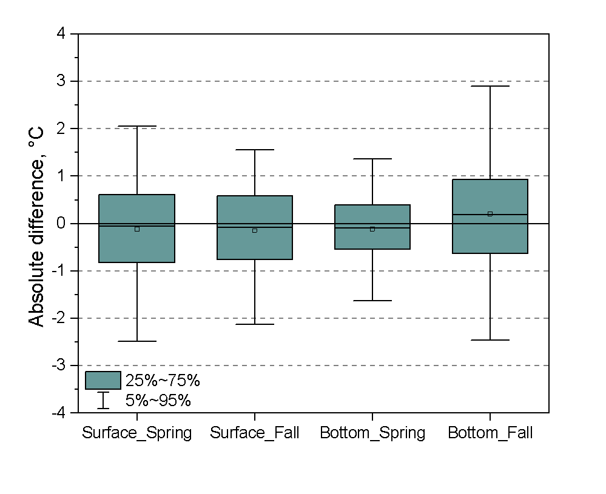

---
title:
    | 
    | Ecosystem Context for Stock Assessments:
    | {{COMMON_NAME}}
always_allow_html: yes
output:  
  html_document:
    includes:
      after_body: footer.html
    fig_caption: yes
bibliography: ECSA_bibliography.bib
---

```{r setup, include = FALSE}
## Load packages
library(ecsa)
library(dplyr)
library(ggplot2)
library(gridExtra)
library(DT)
library(jpeg)
library(cowplot)
library(ggiraph)

# Load in survey data, right now it is only for summer flounder
load("data/df_survdat.rda")

## Read in stock area vectors
all_stock_area <- read.csv("data/seasonal_stock_strata.csv")

## Put all mustaches here
stock_code <- "{{SPECIES_CODE}}"
common_name <- "{{COMMON_NAME}}"
cc_name <- "{{CC_NAME}}"
svspp <- "{{SVSPP}}"
gg_int <- as.logical("{{INTERACTIVE}}")

strata_spring <- all_stock_area %>% 
  dplyr::filter(sp == stock_code,
         season == "spring") %>% 
  dplyr::pull(strata)

strata_fall <- all_stock_area %>% 
  dplyr::filter(sp == stock_code,
         season == "fall") %>% 
  dplyr::pull(strata)

label <- function(variable,value){
  return(facet_names[value])
}

```


## Overview {.tabset .tabset-fade .tabset-pills}

### Introduction
This report provides contextual ecosystem information for {{COMMON_NAME}} (*{{SCI_NAME}}*) on the NE Shelf. Data extractions for spring and fall are confined to the {{COMMON_NAME}} stock area based on respective survey strata sets. The information is intended to span a range of potential factors affecting the productivity and distribution of {{COMMON_NAME}}, including: surface and bottom temperature and salinity, chlorophyll concentrations, indices of habitat, diet composition, and abundance of key zooplankton prey of larval {{COMMON_NAME}}. These factors can be used to qualitatively inform the interpretation of population status and/or quantitatively to improve model responsiveness to ecosystem factors. The range and complexity of ecosystem data makes it unlikely to find the most relevant and comprehensive factor variables with a first evaluation; this process will require an iterative approach of evaluation and feedback. Additional indices can be included to address the needs of the working group.

### Strata definition
```{r strata-map, eval = TRUE, echo = FALSE, fig.cap= "Strata map for {{COMMON_NAME}} (*{{SCI_NAME}}*) on the NE shelf", message = FALSE, warning = FALSE, fig.align='center'}

map_strata(common_name = common_name, spring_strata = spring_strata,
           fall_strata = fall_strata, overwrite = FALSE, save_plot = FALSE)


```


## Surface and bottom temperature {.tabset .tabset-fade .tabset-pills}

An optimal interpolation procedure was used to estimate NE Shelf surface and bottom temperatures for two seasonal time frames (see [methods](#sec:methodstempsalin)). The temperature estimates were standardized to April 3 and October 11 for spring and fall over the period 1968-2017. Spring surface and bottom temperature within the spring {{COMMON_NAME}} stock areas are shown in the upper and lower left figures. Fall surface and bottom temperature within the fall {{COMMON_NAME}} stock areas are shown in the upper and lower right figures.

### Figure

```{r ocean temp, echo = F, fig.align='center', warning=F}
sf1 <- stock_env(variable = "temperature",type = "surface",
                  season = "spring", svspp = svspp, mask_type = "unit")
ss1 <- stock_env(variable = "temperature",type = "surface",
                 season = "fall", svspp = svspp, mask_type = "unit")

bf1 <- stock_env(variable = "temperature",type = "bottom",
                 season = "spring", svspp = svspp, mask_type = "unit")
bs1 <- stock_env(variable = "temperature",type = "bottom",
                 season = "fall", svspp = svspp, mask_type = "unit")
        
surface <- rbind(sf1, ss1)
bottom <- rbind(bf1, bs1)


xmin <- rbind(min(surface$Time),min(bottom$Time))
xmin <- min(xmin)

all_temp <- rbind(surface, bottom)

facet_names <- list(
  'surface temperature spring'="Spring surface",
  'surface temperature fall'="Fall surface",
  'bottom temperature spring'="Spring bottom",
  'bottom temperature fall' = "Fall bottom")

temp_plt <- ggplot(data = all_temp, aes(x = Time, y = Value)) +
  ylab(expression(paste("Temperature ",degree,"C"))) +
  xlab("Year") +
  xlim(xmin, NA) +
  geom_line() +
  {if(gg_int) geom_point_interactive(aes(tooltip = Value, data_id = Time))
    else geom_point()} +
  facet_wrap( ~Var, nrow = 2, labeller = label) +
  theme_bw() +
  theme(strip.background = element_blank()) +
  annotate("text", label = c("","","",""), x = xmin, y = Inf, vjust = 1.5, size = 5)

if (gg_int){
  ggiraph(code = print(temp_plt), width = 0.9, 
         hover_css = "fill:red;r:6pt;")
  } else {
  temp_plt
  }

```

### Data

```{r ocean data, echo = F}


datatable(all_temp, rownames = FALSE,filter = list(position = 'top', clear = FALSE),
          extensions = 'Scroller',
          options = list(search = list(regex = TRUE),
  deferRender = TRUE,
  scrollY = 200,
  scroller = TRUE))

```


## Surface and bottom salinity {.tabset .tabset-fade .tabset-pills}

An optimal interpolation procedure was used to estimate NE Shelf surface and bottom salinity for two seasonal time frames (see [methods](#sec:methodstempsalin)). Though collected with temperature data, reliable instrumentation limits this time series to 1992-2017. The salinity estimates were standardized to April 3 and October 11 for spring and fall. Spring surface and bottom salinity within the spring {{COMMON_NAME}} stock areas are shown in the upper and lower left figures. Fall surface and bottom salinity within the fall {{COMMON_NAME}} stock areas are shown in the upper and lower right figures. 

### Figures
```{r ocean sal, echo = F, fig.align='center', warning=F}
sf1 <- stock_env(variable = "salinity",type = "surface",
                  season = "spring", svspp = svspp, mask_type = "unit")
ss1 <- stock_env(variable = "salinity",type = "surface",
                 season = "fall", svspp = svspp, mask_type = "unit")

bf1 <- stock_env(variable = "salinity",type = "bottom",
                 season = "spring", svspp = svspp, mask_type = "unit")
bs1 <- stock_env(variable = "salinity",type = "bottom",
                 season = "fall", svspp = svspp, mask_type = "unit")
        
surface <- rbind(sf1, ss1)
bottom <- rbind(bf1, bs1)

all_sal <- rbind(surface, bottom)

xmin <- rbind(min(surface$Time),min(bottom$Time))
xmin <- min(xmin)


facet_names <- list(
  'surface salinity spring'="Spring surface",
  'surface salinity fall'="Fall surface",
  'bottom salinity spring'="Spring bottom",
  'bottom salinity fall' = "Fall bottom")

sal_plt <- ggplot(data = all_sal, aes(x = Time, y = Value)) +
  ylab("Salinity (PSU)") +
  xlab("Year") +
  xlim(xmin, NA) +
  geom_line() +
  {if(gg_int) geom_point_interactive(aes(tooltip = Value, data_id = Time))
    else geom_point()} +
  facet_wrap(Var ~., nrow = 2, labeller = label) +
  theme_bw() +
  theme(#plot.title = element_blank(),
        strip.background = element_blank()) +
  annotate("text", label = c("","","",""), x = xmin, y = Inf, vjust = 1.5, size = 5)


if (gg_int){
  ggiraph(code = print(sal_plt), width = 0.9, 
         hover_css = "fill:red;r:6pt;")
  } else {
  sal_plt
  }

```

### Data
```{r sal data, echo = F}

datatable(all_sal, rownames = FALSE,filter = list(position = 'top', clear = FALSE),
          extensions = 'Scroller',
          options = list(search = list(regex = TRUE),
  deferRender = TRUE,
  scrollY = 200,
  scroller = TRUE))

```

## Chlorophyll concentration {.tabset .tabset-fade .tabset-pills}

The concentration of chlorophyll was measured with a suite of satellite sensors and merged into a single dataset (see [methods](#sec:methodschl)). Chlorophyll concentrations in the spring and fall {{COMMON_NAME}} stock areas are shown in the left and right figures. The time series of spring chlorophyll concentration may have impacts on recruitment and growth of the stock, while fall chlorophyll values may affect overwintering nutrition. 

The production cycle of the Northeast Shelf is complex and varies spatially. Patterns of seasonal blooms and the overall annual primary production varies within the stock area for {{COMMON_NAME}}; investigation into the linkages between phytoplankton production and {{COMMON_NAME}} may require additional production metrics. 

### Figures
```{r chl fig, echo = F, fig.align="center", fig.height=3, warning=F}

cs1 <- stock_env(variable = "chlorophyll",
                 season = "spring", svspp = svspp, mask_type = "unit")
cf1 <- stock_env(variable = "chlorophyll",
                 season = "fall", svspp = svspp, mask_type = "unit")
chl <- rbind(cs1, cf1)
xmin <- rbind(min(chl$Time),min(chl$Time))
xmin <- min(xmin)

facet_names <- list(
  'chlorophyll spring'="Spring",
  'chlorophyll fall'="Fall")

chl_plt <- ggplot(data = chl, aes(x = Time, y = Value)) +
    ylab(expression(paste("Chlorophyll mg m"^"-3"))) +
    xlab("Year") +
    xlim(xmin, NA) +
    geom_line() +
    {if(gg_int) geom_point_interactive(aes(tooltip = round(Value,3), data_id = Time))
    else geom_point()}+
    facet_wrap(Season ~., nrow = 1, labeller = label) +
    theme_bw() +
    theme(strip.background = element_blank())+
    annotate("text", label = c("",""), x = xmin, y = Inf, vjust = 1.5, size = 5)

if (gg_int){
  ggiraph(code = print(chl_plt), width = 0.9,  height_svg = 2.5,
         hover_css = "fill:red;r:6pt;")
  } else {
  chl_plt
  }

```


### Data
```{r chl data, echo = F}


datatable(chl, rownames = FALSE,filter = list(position = 'top', clear = FALSE),
          extensions = 'Scroller',
          options = list(search = list(regex = TRUE),
  deferRender = TRUE,
  scrollY = 200,
  scroller = TRUE))

```

## Zooplankton abundance {.tabset .tabset-fade .tabset-pills}

The primary zooplankton species identified in the diet of {{COMMON_NAME}} larvae are <!--{{Z1long}}, {{Z2long}}, and {{Z3long}} ({{Zref}})-->Centropages typicus (CTYP), Temora longicornis (TLONG), and Pseudocalanus spp. (PSEUDO) (Grover 1998). The abundance of these taxa within the respective seasonal stock areas for spring and fall depicted below (see [methods](#sec:methodszoo)). It is assumed that the <!--{{larvalseason}}-->spring abundances of these taxa would be most relevant to the growth and survival of larval {{COMMON_NAME}}. Note that the abundance estimates are based on data that are spatially smoothed within year by first kriging the observational data before the abundances are extracted for the stock area. The spring abundance for <!--{{Z1}}, {{Z2}}, and {{Z3}}-->C. typicus, T. longicornis, and Pseudocalanus are shown in the plots on left, top to bottom, respectively. 

### Figures

```{r zooplankton, echo = F, fig.align="center", warning=F, message=F}
ct1 <- stock_env(variable = "zooplankton", genus = "centropages",
                 season = "spring", svspp = svspp, mask_type = "unit")

ct2 <- stock_env(variable = "zooplankton", genus = "centropages",
                 season = "fall", svspp = svspp, mask_type = "unit")

t1 <- stock_env(variable = "zooplankton", genus = "temora",
                 season = "spring", svspp = svspp, mask_type = "unit")

t2 <- stock_env(variable = "zooplankton", genus = "temora",
                 season = "fall", svspp = svspp, mask_type = "unit")

ps1 <- stock_env(variable = "zooplankton", genus = "pseudocalanus",
                season = "spring", svspp = svspp, mask_type = "unit")

ps2 <- stock_env(variable = "zooplankton", genus = "pseudocalanus",
                season = "fall", svspp = svspp, mask_type = "unit")


zoo <- rbind(ct1, ct2, t1, t2, ps1, ps2)

xmin <- min(zoo$Time)


facet_names <- list(
  'centropages zoo spring'=expression(paste(italic("Centropages "), "spring")),
  'centropages zoo fall'=expression(paste(italic("Centropages "), "fall")),
  'temora zoo spring'=expression(paste(italic("Temora "), "spring")),
  'temora zoo fall' = expression(paste(italic("Temora "), "fall")),
  'temora zoo spring'=expression(paste(italic("Pseudocalanus "), "spring")),
  'temora zoo fall' = expression(paste(italic("Pseudocalanus "), "fall")))


zoo_plt <- ggplot(data = zoo, aes(x = Time, y = Value)) +
    ylab(expression(paste("Abundance log num m"^"-3"))) +
    xlab("Year") +
    xlim(xmin, NA) +
    geom_line() +
    {if(gg_int) geom_point_interactive(aes(tooltip = round(Value,3), data_id = Time))
    else geom_point()}+
    facet_wrap(Var ~ ., nrow = 3, ncol = 2, labeller = label) +
    theme_bw() +
    theme(strip.background = element_blank()) +
    annotate("text", label = c("","","",
                               "","",""), x = xmin, y = Inf, vjust = 1.5, size = 5)

if (gg_int){
  ggiraph(code = print(zoo_plt), width = 0.9, 
         hover_css = "fill:red;r:6pt;")
  } else {
  zoo_plt
  }


```

### Data
```{r zoo data, echo = F}
datatable(zoo, rownames = FALSE,filter = list(position = 'top', clear = FALSE),
          extensions = 'Scroller',
          options = list(search = list(regex = TRUE),
  deferRender = TRUE,
  scrollY = 200,
  scroller = TRUE))
```

## Probability of occurence and habitat area {.tabset .tabset-fade .tabset-pills}

Probability of occurrence of {{COMMON_NAME}} in NEFSC bottom trawl tows was estimated in each season and year using a logistic regression, i.e., a GLM with a bionomial response and log-odds link (code: https://github.com/NOAA-EDAB/ECSA/blob/master/prob_occurence.R). Error bars represent the 95% confidence intervals.

### Figures
```{r trawl-habitat, echo = FALSE, fig.align='center', warning=F, fig.height=3}


df_survdat_spring <-
  df_survdat %>%
  dplyr::filter(YEAR > 1976,
                ## place holder for filtering survdat by species
                SEASON == "SPRING",
                STRATUM %in% strata_spring)

df_survdat_fall <-
  df_survdat %>%
  dplyr::filter(YEAR > 1976,
                ## place holder for filtering survdat by species
                SEASON == "FALL",
                STRATUM %in% strata_fall)

df_survdat2use <-
  rbind(df_survdat_spring,
        df_survdat_fall) %>%
  dplyr::mutate(pres = BIOMASS > 0)


df_prob_occ <-
  df_survdat2use %>%
  dplyr::group_by(SEASON, YEAR) %>%
  dplyr::do(calc_p(df = .)) %>% 
  ungroup() %>% 
  mutate(SEASON = tolower(SEASON),
         SEASON = factor(SEASON, levels = c("spring", "fall")))

facet_names <- list(
  'spring'="Spring",
  'fall' = "Fall")

# Make plot
prob_occ_plt <- ggplot(df_prob_occ, 
       aes(x = YEAR, y = p)) +
  {if(gg_int) geom_point_interactive(aes(tooltip = round(p,3), data_id = YEAR))
    else geom_point()}+
  geom_errorbar(aes(ymin = p_low, ymax = p_high), 
                size = 0.3, width = 0.3) +
  geom_line() +
  xlab("Year") +
  ylab("Probability of occurence") +
  theme_bw() +
  theme(strip.background = element_blank()) +
  facet_wrap(~ SEASON, labeller = label)


if (gg_int){
  ggiraph(code = print(prob_occ_plt), width = 0.9, height_svg = 2.5,
         hover_css = "fill:red;r:6pt;")
  } else {
  prob_occ_plt
  }

```

### Data
```{r prob data, echo = F}
datatable(df_prob_occ, rownames = FALSE,filter = list(position = 'top', clear = FALSE),
          extensions = 'Scroller',
          options = list(search = list(regex = TRUE),
  deferRender = TRUE,
  scrollY = 200,
  scroller = TRUE))
```

## Occupancy habitat {.tabset .tabset-fade .tabset-pills}

The probability of occurrence was also estimated using classification random forest models (see [methods](#sec:methodsocc)). The probabilities were extracted for the spring and fall stock definition areas. The occupancy probability is shown in the upper plots and the occupancy area is shown in the lower plots, with spring on the left and fall on the right for all plots.

### Figures
```{r rf_occupancy, fig.align="center", echo = F, warning=F}
o1 <- stock_env(variable = "occupancy prob", season = "spring",
                svspp = svspp, mask_type = "unit")

o2 <- stock_env(variable = "occupancy prob", season = "fall",
                svspp = svspp, mask_type = "unit")

o3 <- stock_env(variable = "occupancy hab", season = "spring",
                svspp = svspp, mask_type = "unit")

o4 <- stock_env(variable = "occupancy hab", season = "fall",
                svspp = svspp, mask_type = "unit")

prob <- rbind(o1, o2)
hab <- rbind(o3, o4)

hab$Value <- hab$Value/100

xmin <- rbind(min(hab$Time),min(prob$Time))
xmin <- min(xmin)

facet_names <- list(
  'occupancy hab spring'="Occupancy prob. spring",
  'occupancy hab fall' = "Occupancy prob.
  fall")

op_plt <- ggplot(data = prob, aes(x = Time, y = Value)) +
  ylab("Occupancy Probability") +
  xlab("Year") +
  xlim(xmin, NA) +
  geom_line() +
  {if(gg_int) geom_point_interactive(aes(tooltip = round(Value,3), data_id = Time))
    else geom_point()}+
  facet_wrap(Season ~., nrow = 1, labeller = label) +
  theme_bw() +
  theme(strip.background = element_blank()) +
  annotate("text", label = c("",""), x = xmin, y = Inf, vjust = 1.5, size = 5)

label2 <- function(variable,value){
  return(facet_names2[value])
}
facet_names2 <- list(
  'occupancy prob spring'="Occupancy habitat spring",
  'occupancy prob fall' = "Occupancy habitat fall")

oh_plt <- ggplot(data = hab, aes(x = Time, y = Value)) +
  ylab(expression(paste("Occupancy Habitat 10"^"2 "," km"^"-2"))) +
  xlab("Year") +
  xlim(xmin, NA) +
  geom_line() +
  {if(gg_int) geom_point_interactive(aes(tooltip = Value, data_id = Time))
    else geom_point()} +
  facet_wrap(Season ~., nrow = 1, labeller = label2) +
  theme_bw() +
  theme(strip.background = element_blank()) +
  annotate("text", label = c("",""), x = xmin, y = Inf, vjust = 1.5, size = 5)

if (gg_int){
  ggiraph(code = print(plot_grid(oh_plt, op_plt, nrow = 2)), width = 0.9, 
         hover_css = "fill:red;r:6pt;")
  } else {
  grid.arrange(oh_plt, op_plt, nrow = 2)
  }
```

### Data
```{r prob data2, echo = F}
occ <- rbind(prob, hab)
datatable(occ, rownames = FALSE,filter = list(position = 'top', clear = FALSE),
          extensions = 'Scroller',
          options = list(search = list(regex = TRUE),
  deferRender = TRUE,
  scrollY = 200,
  scroller = TRUE))
```

## Diet composition {.tabset .tabset-fade .tabset-pills}

Food habits collected aboard NEFSC bottom trawl surveys in the {{COMMON_NAME}} seasonal survey strata were used to estimate weighted diet composition over time (see [methods](#sec:methodsdiet)), as well as length composition of sampled fish and sample size. Here we show annual and seasonal weighted diet composition for major prey (averaging over 10 percent of diet across years). Food habits data for {{COMMON_NAME}} have been collected from 1977-present [@smith_trophic_2010]. 

```{r dietdat, eval=F, echo = FALSE}
#{{COMMON_NAME}} stomachs are collected XXX size strata. Over XX {{COMMON_NAME}} stomachs have been collected to date from over XXX survey tows. Predator length ranged in size from X to X cm.
#[add: number+hauls sampled and length comp of sampled {{COMMON_NAME}} in each time block below]
```


### Figures
```{r diet, eval=T, echo = FALSE, fig.align='center', fig.height=14}
  
#df_diet <- get_diet() #hidden output somewhere need to fix, function still broken dont use

load("data/df_diet.RData")

diet <- df_diet %>%
  dplyr::select(year, season, prey, relmsw, nstom, num_tows)
  
dietmain <- diet %>%
    dplyr::group_by(season, prey) %>%
    dplyr::filter(relmsw>0.01) %>%
    dplyr::filter(mean(relmsw)>10.0)
  
# compplot2 <- ggplot(dietmain, aes(year, relmsw)) + 
#     geom_bar(stat="identity")
#   
# compplot2 + facet_wrap(season ~ prey, nrow=10) + theme(legend.position="none")
  
compplot <- ggplot(dietmain, aes(year, relmsw, fill=prey)) + 
    #geom_bar(stat = "identity", aes(fill=fillwhite)) 
    ylab("Percent in Diet") +
    xlab("Year") +
    #geom_bar(stat = "identity") +
    facet_wrap("season", nrow=3) +
    theme_bw() + 
    viridis::scale_fill_viridis(discrete = TRUE) +
    theme(legend.position="bottom", 
          legend.text=element_text(size=5))

compi <- compplot + geom_bar_interactive(stat = "identity", aes(tooltip = prey, data_id = prey)) 

ggiraph(code = print(compi), height=14)

```

### Data
```{r diet data, echo = F}
datatable(diet, rownames = FALSE,filter = list(position = 'top', clear = FALSE),
          extensions = 'Scroller',
          options = list(search = list(regex = TRUE),
  deferRender = TRUE,
  scrollY = 200,
  scroller = TRUE))
```

## Methods {#sec:methods}

### Surface and Bottom Temperature and Salinity {#sec:methodstempsalin}

#### Study System
The U.S. Northeast Shelf ecosystem, which roughly aligns with the boundaries of the Northeast U.S. Continental Shelf Large Marine Ecosystem (LME), is the study area for the surface and bottom thermal environments. Surface and bottom temperatures were estimated over a 0.1° latitude/longitude grid, termed the estimation grid, which circumscribes the range of ecosystem assessment areas in the [region](#fig:study-area). The difference between the extents of the estimation grid from the extent of the LME relate to the resource management programs that are the sources of the data, which are focused on fishery management needs in the region. 

#### Data Source
Temperature and salinity were collected on the Northeast Shelf as part of ongoing resource and ecosystem surveys conducted by the Northeast Fisheries Science Center. Water column temperatures have been collected contemporaneously to trawl tows associated with a bottom trawl survey beginning in the fall of 1963 and five years later during spring [@Despres1988]. In addition, the ecosystem has been surveyed by multiple sampling programs with varying sampling designs. The two most comprehensive monitoring programs over the study period were the MARMAP (1977-1987) and the Ecosystem Monitoring Program or EcoMon (1992-present) programs, both serving as shelf-wide surveys of the ecosystem [@Sherman1998; @Kane2007]. Temperature measurements were made with a mix of Conductivity Temperature and Depth (CTD) instruments, analog XBT, digital XBT, mechanical BT, glass thermometers (bottle temps) and trawl mounted temperature loggers instruments collecting either water column profiles or temperatures  measured at targeted depths. Salinity measurements used in this analysis was limited to 1992-2017 when CTD instrument were used. Surface and bottom temperatures were identified from these measurements. Temperatures representing the spring period include data collected during the months of February to June; however, 99% of the samples were collected during the months of March to May. Likewise, the fall period samples include data collected during September to December, with 99% of the samples collected during September to November. The total number of surface temperature measurements were 14,540 and 14,666 for spring and fall, respectively; and, 14,450 and 14,656 for spring and fall bottom temperature, respectively. On average, there were 290 temperature measurements by season, depth, and year. The number of salinity observation per year were similar.

#### Interpolation Procedure
Seasonal surface and bottom temperature fields were estimated using an optimal interpolation approach. The optimal interpolation combined a climatological depiction of temperature and an annual estimates based on the data for a particular depth and season. (There were a number of precursor steps that are described below.).  
The surveys used to collect the data were conducted during the same period each year, however, there was variation in survey timing. To account for this, temperatures were standardized to a collection date of April 3 for spring surveys and October 11 for fall using linear regression for each depth and season over the sample grid (see Appendix, [Figure A1](#fig:doc_correction)). For each depth and season, annual shelf-wide mean temperatures were calculated using the data from sample grid locations with at least 80% of the time series present. The annual observations were then transformed to anomalies by subtracting the appropriate annual mean. All anomalies for a season and depth were combined over years into a single anomaly field or climatology. 

The annual estimate of temperature for a depth and season was imputed by used universal kriging to estimate the temperature over the estimation grid with depth as a covariate. The kriging yielded temperature estimates and a variance estimate over the same grid. The optimal interpolation field was assembled by combining the annual estimate and information from the anomaly climatology. The climatology was re-leveled from anomaly values to temperatures by adding back the appropriate annual mean. For each location in the estimation grid, temperature was calculated as a weighted mean between the kriged annual estimate and the releveled climatology. The weightings in the calculations were partitioned based on the variance field of the annual kriging. The field was divided into quartiles from low to high variance with the weighting ratio of annual:climatology temperatures of 4:1, 3:1, 2:1, and 1:1, respectively. Hence, in areas of low variance the weighted mean was based on a weighting of 4:1, which would reflect a higher contribution of information from the annual estimate and thus be closer to an observation. In areas with high variance, the weighting ratio of 1:1 would reflect a greater effect of the climatology in determining the interpolation estimate. 

The optimal interpolation temperature fields were evaluated using cross validation and a comparison to external data. The performance of optimal interpolation was compared to the predictive skill of using either the climatology or annual interpolation alone by doing ten random cross validations of each treatment. Each random draw of training and test sets sampled 3% of the data for the test set, or about 500 observations per draw. The temperature fields were fit with the training data and compared with the test set data. The lowest error rates were realized with the optimal interpolation contrasted with highest predictive error associated with fields based on the climatology alone (see Appendix, [Figure A2](#fig:cross_val)). The spatial distribution of error had distinct depth and seasonal patterns. The spatial errors associated with the surface estimates were generally low with the exception of a few locations along the shelf break between latitudes 39-41°N; the spatial error in the bottom temperature varied by season, and was concentrated along the shelf break in spring and across the shelf between latitudes 36-40°N in fall (see Appendix, [Figure A3](#fig:oi_mae)). The optimal interpolation data were also compared to external data from other collection programs. The absolute errors between surface temperature data collected by satellites and the interpolation had interquartile ranges of approximately ±0.75°C (see Appendix, [Figure A4](#fig:oi_compare)). The absolute error in a comparison of interpolated bottom temperature to opportunist sampling was approximately ±0.75°C for spring bottom temperature and approximately 0.75-1.0°C in the fall. Salinity was estimated in the same way with the exception of collection correction, which was deemed unnecessary for the salinity data.

#### {#fig:study-area}

```{r study area, echo = F, fig.align="center", fig.cap = "Map of the study system with half-degree sample grid (blue lines) and extent of estimation grid shown in beige points (a). Major features of the study system with shelf break marked in purple line (b). 100m depth shown as dashed line."}
knitr::include_graphics('data/images/ECSA_study_area.jpg')
```

### Chlorophyll data {#sec:methodschl}
Chlorophyll a concentration ([Chl]) data extracted from satellite remote-sensing databases based on measurements made with the Sea-viewing Wide Field of View Sensor (SeaWiFS), Moderate Resolution Imaging Spectroradiometer on the Aqua satellite (MODIS), Medium Resolution Imaging Spectrometer (MERIS), and Visible and Infrared Imaging/Radiometer Suite (VIIRS) sensors. We used the Garver, Siegel, Maritorena Model (GSM) merged data product at 100 km (equivalent to a 1° grid) and 8-day spatial and temporal resolutions, respectively, obtained from the [Hermes GlobColour website](www.hermes.acri.fr/index.php). These four sensors provide an overlapping time series of [Chl] during the period 1997 to 2018 and were combined based on a bio-optical model inversion algorithm (Maritorena et al. 2010).  

### Zooplankton abundance {#sec:methodszoo}
Zooplankton abundance is measured by the Ecosystem Monitoring Program (EcoMon), which conducts shelf-wide bimonthly surveys of the NES ecosystem [@Kane2007]. Zooplankton and ichthyoplankton are collected throughout the water column to a maximum depth of 200 m using paired 61-cm Bongo samplers equipped with 333-micron mesh nets. Sample location in this survey is based on a randomized strata design, with strata defined by bathymetry and along-shelf location. Plankton taxa are sorted and identified. We used the bio-volume of the 18 most abundant taxonomic categories as potential predictor variables [(Table 2)](#fig:habitatdesc). The zooplankton sample time series has some missing values, which necessitated the removal of spring data for the years 1989, 1990, 1991, and 1994 and fall data for the years 1989, 1990, and 1992. The data for each seasonal time frame was interpolated to a complete field over the estimation grid using ordinary kriging. 

#### {#fig:zooptab}

```{r zooptab, echo=F, message=FALSE, warnings=FALSE, results='asis'}
tabl <- "
|Variable name|Full name|
|:----------|:-----------|
|acarspp|*Acartia* spp. |
|calfin|*Calanus finmarchicus* |
|chaeto|*Chaetognatha*|
|cham|*Centropages hamatus* |
|cirr|*Cirripedia*|
|ctyp|*Centropages typicus* |
|echino|*Echinodermata*|
|evadnespp|*Evadne* spp.|
|gas|*Gastropoda*|
|hyper|*Hyperiidea*|
|larvaceans|*Appendicularians*|
|mlucens|*Metridia lucens* |
|oithspp|*Oithona* spp. |
|para|*Paracalanus* parvus |
|penilia|*Penilia* spp.|
|pseudo|*Pseudocalanus* spp. |
|salps|*Salpa*|
|tlong|*Temora longicornis*| 
"
df<-suppressWarnings(readr::read_delim(tabl, delim="|"))
df<-df[-c(1,2) ,c("Variable name","Full name")]
knitr::kable(
  df, booktabs = TRUE,
  caption = 'Variable and species names for the 18 most abundant zooplankton taxa in EcoMon survey data.'
)
```

### Occupancy models {#sec:methodsocc}

Occupancy and productivity habitats for summer flounder were estimated with random forest classification and regression  models using a suite of static and dynamic predictor variables. Variation in species presence or absence and biomass across space, bathymetry factors, productivity factors, and climate factors were tested. Models were constructed separately for spring and fall seasons. The response variables were the occurrence and catch-per-unit-effort of summer flounder in the Northeast Fisheries Science Center bottom trawl survey, which is a fishery-independent survey on the Northeast US Shelf. The survey is conducted in the spring and fall of the year and is based on a stratified random design, which provides both spatial and temporal depictions of fish and macroinvertebrate abundances [@Grosslein1969]. The independent or predictor variable set included physical environment variables, habitat descriptors, zooplankton variables, and remote sensing variables; the variables will be described in more detail below. Occupancy models were fit as two-factor classification models (absence as 0; presence as 1) using the randomForest R package [@randomForest].

Prior to fitting the model, the independent variable set was first tested for multi-collinearity among the predictors and correlated variables were eliminated (R package @rfUtilities-package, version 2.1-3). From this reduced set of predictors, the final model variables were selected utilizing the model selection criteria of [@Murphy2010] as implemented in rfUtilities. Productivity models were fit as regression models with log10 transformed biomass-per-unit-effort as the response variable and the same starting set of predictor variables as in the occupancy models. As with the occupancy models, independent variables were tested for multi-collinearity and the model selection criteria was applied. Habitat was estimated from the model fits over a standard 0.1° grid, which circumscribes the range of ecosystem assessment areas [in the region](#fig:study-area). 

Three types of visualizations were created from the output of the tree models. The first visualization was used to see the average probability of occupancy over space and the rate of change (Sen's slope) in occupancy over the years. The second visualization was used to see the mean occupancy gradient magnitude, or frontal strength and the rate of change (Sen's slope) in occupancy gradient magnitude over the years. Gradient magnitude was calculated by calculating the median of the occupancy probabilities with a moving window and then summing those medians with a moving window with a matrix of weights. The third visualization was used to see the average biomass over space and the rate of change (Sen's slope) in biomass over the years. Trends in total occupancy habitat area, with occupancy probabilities of 25, 50, and 75% over time were plotted as well by calculating the sum of the area with occupancy probabilities at each percentage during each year. 

#### Predictor Variables
Static variables were kept constant over years where dynamic variables varied annually. Hence, the length of the time series of model fits is constrained by the shortest dynamic variable time series to meet the requirement of complete cases in the Random Forest fitting. The fitting time series was constrained to 1992 – 2016, which was determined by the length of the station salinity data. 

#### Physical environment
Station data included observations made contemporaneously to survey bottom trawl stations. Depth of the station was used as a static variable in the analysis. The observed depth was used in model fitting where model predictions were based on depths from the ETOPO1 dataset, which provided Northeast Shelf bathymetry at a resolution of 0.0167° [(below)](#fig:occ_grid).

#### {#fig:occ_grid}

```{r occ_grid, fig.align="center", fig.cap = "Estimation grid for predictor variable and habitat estimates, grid location spaced by 0.1° longitude and latitude.", echo = F, out.width=switch(knitr::opts_knit$get("rmarkdown.pandoc.to"), latex = "0.5\\linewidth", html = '500')}
knitr::include_graphics("data/images/ECSA_occ_grid.png")
```


Surface and bottom water temperature and salinity were used as dynamic variables in the analysis. Temperature and salinity on the NE Shelf was collected using Conductivity/Temperature/Depth (CTD) instruments with the most complete sample coverage associated with spring (February –April) and fall (September-November) time frames. Surface and bottom temperatures were used to develop date of collection corrections using linear regression for each time frame. Temperatures were standardized to a collection date of April 3 for spring collections and October 11 for fall. A date of collection correction was not indicated for salinity data. The observed date-corrected temperature (°C) and uncorrected salinity data (PSU) was used in model fitting. 

Model predictions were based on temperature and salinity fields using an optimal interpolation approach where annual data were combined with a climatology by season. For a half degree grid of the ecosystem, mean bottom temperature or salinity was calculated by year and season. For grid locations that had data for at least 80% of the time series, the data from those locals were used to calculate a seasonal mean. The annual seasonal means were used to calculate anomalies, which were combined over the time series to provide seasonal, surface and bottom anomaly climatologies. 

Returning to the raw data, the observations for a year, season, and depth were then used to estimate an annual field using universal kriging with depth as a covariate. The kriging was done on a standard 0.1° grid using the automap [@automap, version 1.0-14]. The annual field was then combined with the climatology anomaly field, adjusted by the annual mean, using the variance field from the kriging as the basis for a weighted mean between the two. The variance field was divided into quartiles with the first quartile (lowest kriging variance) carrying a weighting of 4:1 between the annual and climatology values. Hence, the optimal interpolated field at these locations were skewed towards the annual data reflecting their proximity to actual data locations and low kriging variance associated with them. The weighting ratio shifted to 1:1 in the highest variance quartile reflecting less information from the annual field and more from the climatology.

#### Habitat Descriptors
Habitat descriptors are a series of static variables that reflect the shape and complexity of benthic habitats. Since the response variables for these models are derived from bottom trawl gear, naturally the range of candidate taxa for modelling is skewed to benthic organisms, making these descriptors particularly relevant. Most of the variables are based on depth measurement, including the complexity, BBI, VRM, Prcurv, rugostity, seabedforms, slp, and slpslp variables [(Table 1)](#fig:habitatdesc). The soft-sed variable is based on benthic sediment grain size and the vorticity variable is based on current estimates.

#### Zooplankton Data
Zooplankton abundance is measured by the Ecosystem Monitoring Program (EcoMon), which conducts shelf-wide bimonthly surveys of the NES ecosystem [@Kane2007]. Zooplankton and ichthyoplankton are collected throughout the water column to a maximum depth of 200 m using paired 61-cm Bongo samplers equipped with 333-micron mesh nets. Sample location in this survey is based on a randomized strata design, with strata defined by bathymetry and along-shelf location. Plankton taxa are sorted and identified. We used the bio-volume of the 18 most abundant taxonomic categories as potential predictor variables [(Table 2)](#fig:habitatdesc). The zooplankton sample time series has some missing values which were ameliorated by summing data over five-year time steps for each seasonal time frame and interpolating a complete field using ordinary kriging. Thus, for example, the data for spring 2000 would include the available data from 1998-2002 tows. 

#### Remote Sensing Data
Chlorophyll concentration and SST from remote sensing sources were applied in the habitat models as static variables. Chlorophyll and SST were summarized as monthly means with their associated gradient magnitude or frontal fields. The basis for the chlorophyll concentration was measurements made with the Sea-viewing Wide Field of View Sensor (SeaWiFS), Moderate Resolution Imaging Spectroradiometer on the Aqua satellite (MODIS), Medium Resolution Imaging Spectrometer (MERIS), and Visible and Infrared Imaging/Radiometer Suite (VIIRS) sensors during the period 1997-2016. The data is a merged product using the Garver, Siegel, Maritorena Model (GSM) algorithm obtained from the [Hermes GlobColour website](www.hermes.acri.fr/index.php). 

These four sensors provide an overlapping time series of chlorophyll concentration during the period and were combined based on a bio-optical model inversion algorithm (Maritorena et al. 2010). Monthly SST fields were based on data from the MODIS Terra sensor data available from the [Ocean Color Website](http://oceancolor.gsfc.nasa.gov/cms/). From these data, mean monthly fields were generated for both chlorophyll and SST. There are a range of methods used to identify fronts [@Belkin2009] in oceanographic data that usually apply some focal filter to reduce noise and identify gradient magnitude with a Sobel filter. These calculations were done in R using the raster package [@raster, version 2.6-7] using a 3 by 3 mean focal filter and a Sobel filter to generate x and y derivatives, which are then used to calculate gradient magnitude. 

#### Model Selection Criteria and Variable Importance

The habitat models were evaluated for fit based on out-of-bag classification accuracy. For occupancy models accuracy, AUC (Area Under the ROC Curve), and Cohen’s Kappa were calculated using the irr R package [@irr, version 0.84]. For regression models, the variance explained by the model, mean absolute error, the root mean square error, and bias were calculated using the Metrics R package [@metrics, version 0.1.3]. To evaluate variable importance in both occupancy and regression models, we plotted the number of times a variable was the root variable versus the mean minimum node depth for the variable, highlighting the top ten important variables using the randomForestExplainer R package [@randomForestExplainer, version 0.9]. For occupancy models we also plotted the Gini index decrease versus accuracy decrease, whereas for the regression models we plotted node purity increase versus MSE increase, also highlighting the top ten most important variables. 

#### {#fig:habitatdesc}

```{r habitatdesc, echo = F, results='asis', message=F, warning=F}
tab <- '
|Variables|Notes|References|
|:-----------------------|:-----------------------|:-----------------------|
|Complexity - Terrain Ruggedness Index|The difference in elevation values from a center cell and the eight cells immediately surrounding it. Each of the difference values are squared to make them all positive and averaged. The index is the square root of this average.|@Riley1999|

|Namera bpi|BPI is a second order derivative of the surface depth using the TNC Northwest Atlantic Marine Ecoregional Assessment ("NAMERA") data with an inner radius=5 and outer radius=50.|@Lundblad2006|

|Namera_vrm|Vector Ruggedness Measure (VRM) measures terrain ruggedness as the variation in three-dimensional orientation of grid cells within a neighborhood based the TNC Northwest Atlantic Marine Ecoregional Assessment ("NAMERA") data.|@Hobson1972; @Sappington2007|

|Prcurv (2 km, 10 km, and 20 km)|Benthic profile curvature at 2km, 10km and 20 km spatial scales was derived from depth data.|@Winship2018|

|Rugosity|A measure of small-scale variations of amplitude in the height of a surface, the ratio of the real to the geometric surface area.|@Friedman2012|

|seabedforms|Seabed topography as measured by a combination of seabed position and slope.|[http://www.northeastoceandata.org/]()|

|Slp (2 km, 10 km, and 20 km)|Benthic slope at 2km, 10km and 20km spatial scales.|@Winship2018|

|Slpslp (2 km, 10 km, and 20 km)|Benthic slope of slope at 2km, 10km and 20km spatial scales|@Winship2018|

|soft_sed|Soft-sediments is based on grain size distribution from the USGS usSeabed: Atlantic coast offshore surficial sediment data.|[http://www.northeastoceandata.org/]()|

|Vort (fall - fa; spring - sp; summer - su; winter - wi)|Benthic current vorticity at a 1/6 degree (approx. 19 km) spatial scale.|@Kinlan2016|

'
df<-readr::read_delim(tab, delim="|")
df<-df[-c(1,2,3) ,c("Variables","Notes","References")]
knitr::kable(
  df, booktabs = TRUE,
  caption = 'Habitat descriptors used in occupancy model parameterization.'
)
```

### Diet composition {#sec:methodsdiet}
NEFSC bottom-trawl sampling occurs twice annually in the spring (March-May) and fall (September-November). The survey area encompasses about 293,000 square km of continental shelf from Cape Hatteras, NC, to Nova Scotia, Canada in depths from 8-400 m. Food habits sampling has been conducted since 1973. 

Stomachs are collected at sea by NEFSC, and have been primarily analyzed at sea since 1981. Total stomach volume is estimated, each prey item is identified and sorted to the lowest possible taxonomic level, and the proportion of each prey item is estimated. Detailed methods are described in @link_overview_2000.
Prey composition percent by weight was calculated using a weighted mean ($\overline{W_{ijs}}$) [@link_overview_2000; @smith_trophic_2010] to estimate mean weight of prey $i$ in predator $j$ for statistical group $s$. Note: Prey volumes are used as proxies for prey weight. It may be calculated as

$$ \overline{W_{ijs}} = \frac{\sum_{t=1}^{N_{ts}}N_{jts}\overline{w_{ijts}}}{N_{ts}} $$

where $t$ represents an individual bottom trawl tow, $N_{jts}$ is the number of predator $j$ stomachs in tow $t$ for statistical group $s$, $N_{ts}$ is the number of tows in statistical group $s$, and
                
$$ \overline{w_{ijts}} = \frac{\sum_{k=1}^{N_{jts}}w_{ijtsk}}{N_{jts}} $$
            
## Appendix 

#### Date of collection correction
The dates of survey data collection varied by year. To date correct temperature measurements, regressions were estimated between temperature and day of the year over the sample grid (0.5° grid) by season and depth. Spring data were transformed to a temperature representing April 3 and fall to October 11 based on the slope estimates shown in the maps in [Figure A1](#fig:doc_correction). 

#### {#fig:doc_correction}

```{r doc_correction, fig.align = "center", echo = F, fig.width=6, fig.cap = "**Figure A1**: Spring (a) and fall (b) linear slope coefficients used to date correct surface temperature to standard spring and fall dates; same for spring (c) and fall (d) bottom temperature correction."}
par(mar=c(0,0,0,0), xpd=NA, mgp=c(0,0,0), oma=c(0,0,0,0), ann=F, mfrow = c(2,2))

a <-jpeg::readJPEG('data/images/ECSA_doc_correction_a.jpg')
b <-jpeg::readJPEG('data/images/ECSA_doc_correction_b.jpg')
c <-jpeg::readJPEG('data/images/ECSA_doc_correction_c.jpg')
d <-jpeg::readJPEG('data/images/ECSA_doc_correction_d.jpg')

plot.new()
usr<-par("usr")
 
#fill plot with images
rasterImage(a, usr[1], usr[3], usr[2], usr[4])
rasterImage(b, usr[1]+1.1, usr[3], usr[2]+1.1, usr[4])
rasterImage(c, usr[1], usr[3]-1.1, usr[2], usr[4]-1.1)
rasterImage(d, usr[1]+1.1, usr[3]-1.1, usr[2]+1.1, usr[4]-1.1)

```

<br>

#### Cross validation performance of temperature interpolation
A series of random draws of training and test sets were taken to evaluate the predictive skill of the estimation procedure. A set of climatology, annual interpolation, or optimal interpolation fields were estimated using the training set and compared to the held-out test set. 

#### {#fig:cross_val}

```{r cross_val, fig.align="center", fig.cap = "**Figure A2**: Mean and 95% confidence intervals of squared errors for spring (a) and fall (b) surface temperature estimates based on climatology, annual interpolation, and optimal interpolation (OI); same data for spring (c) and fall (d) bottom temperature estimates.", echo = F}
knitr::include_graphics("data/images/ECSA_crossval_temp_oi.png")
```

<br>

The distribution of errors from the optimal interpolation test sets were evaluated spatially to determine where the larger errors occurred and what ecosystem features they are associated with.

#### {#fig:oi_mae}
```{r oi_mae, fig.align = "center", echo = F, fig.width=5.75, fig.cap = "**Figure A3**: Mean absolute error by 0.1 degree latitude and longitude intervals for spring (a) and fall (b) surface temperature; same data for spring (c) and fall (d) bottom temperature. Red indicates a positive error where blue indicates negative."}
par(mar=c(0,0,0,0), xpd=NA, mgp=c(0,0,0), oma=c(0,0,0,0), ann=F, mfrow = c(2,2))

a <-jpeg::readJPEG('data/images/ECSA_oi_error_dist_a.jpg')
b <-jpeg::readJPEG('data/images/ECSA_oi_error_dist_b.jpg')
c <-jpeg::readJPEG('data/images/ECSA_oi_error_dist_c.jpg')
d <-jpeg::readJPEG('data/images/ECSA_oi_error_dist_d.jpg')

plot.new()
usr<-par("usr")
 
#fill plot with images
rasterImage(a, usr[1], usr[3], usr[2], usr[4])
rasterImage(b, usr[1]+1.1, usr[3], usr[2]+1.1, usr[4])
rasterImage(c, usr[1], usr[3]-1.1, usr[2], usr[4]-1.1)
rasterImage(d, usr[1]+1.1, usr[3]-1.1, usr[2]+1.1, usr[4]-1.1)

```

<br>

#### Comparisons to external data sources

Sea surface temperature estimated in this study were compared to the [OISST dataset](https://www.ncdc.noaa.gov/oisst) serving as a source of data for external comparison. The OISST data for April 3 (spring) and October 11 (fall) over the period 1982-2017 were extracted on the same 0.5° grid used in the study. Time series of matching spring and fall temperatures were differenced (external minus interpolation data) and presented in the figure below (sample size for surface spring and fall data were 5220 and 5365, respectively). The interquartile range for the surface comparisons were generally symmetric around zero with differences between 0.5-1°C. Bottom temperature estimated in this study were compared to the data from a cooperative data collection program for external comparison. The “Environmental Monitors on Lobster Traps” [(EMOLT)](http://comet.nefsc.noaa.gov/erddap/tabledap/eMOLT.html) is a cooperative research program that collects bottom temperatures. The data for spring and fall were extracted from rasters of the study data to match the extremal data. The external data covered the period 1968-2017, with 360 data points for the spring and 728 for the fall. Spring bottom comparisons yielded the smallest interquartile range of differences less than 0.5°C, where fall comparisons were slightly larger and biased to lower interpolation estimates compared to the external data.

#### {#fig:oi_compare}

```{r oi_compare, fig.align="center", fig.cap = "**Figure A4**: Box plots (box: interquartile range, whisker: 5-95% range, square symbol: mean, line: median) of the difference between external and interpolation data.", echo = F}

```


### References


_Last updated on `r format(Sys.Date(), format = "%B %e %Y")`._